# Plan Agent: cierre de hallazgos ARGOS-IT

Límites honestos: **"cero fallos" absolutos** no son garantizables sin pentest externo y pruebas E2E en tu entorno; este plan **elimina los defectos identificados en el análisis previo** y deja el stack **coherente, seguro por diseño en esas áreas y funcional**.

```mermaid
flowchart LR
  subgraph phase1 [Fase 1 Seguridad critica]
    WS[Socket.IO JWT]
    Stats[Security stats ACL]
    Refresh[Refresh token y rol]
  end
  subgraph phase2 [Fase 2 Datos reales]
    Portal[GET /api/client/portal]
    UI[Dashboard badges y vacios]
  end
  subgraph phase3 [Fase 3 IA Ops SEO]
    AI[Validacion mensajes IA]
    Docker[Compose hostname]
    Env[Env examples y README]
    SEO[Metadata servicios e idioma]
  end
  subgraph phase4 [Fase 4 Verificacion]
    QA[verify y smoke]
  end
  subgraph phase5 [Fase 5 Post MVP]
    AdminSeed[Seed admin]
    IaPol[Politica IA]
    WsOrE2E[WS o E2E]
  end
  phase1 --> phase2 --> phase3 --> phase4 --> phase5
```

---

## Fase 1 — Seguridad crítica (backend)

### 1.1 Socket.IO: autenticación y `userId` no falsificable

- Archivo: [`backend/server.js`](backend/server.js).
- Implementar middleware `io.use` que lea el JWT desde `handshake.auth.token` o `handshake.query.token`, verifique con `JWT_SECRET` (misma lógica que [`backend/middleware/auth.js`](backend/middleware/auth.js)) y rechace conexión si falla.
- En el handler `user_action`: **ignorar** `data.userId` del cliente; usar **siempre** `socket.userId` (o `socket.data.user`) del token.
- Añadir allowlist de `type` (strings esperados) y tamaño máximo de `details` antes de `JSON.stringify` / insert.
- **Frontend:** hoy no hay uso de `socket.io-client` en TS/TSX (solo dependencia); si en el futuro conectas Chico, documentar en README que hay que pasar `{ auth: { token } }`. Opcional: eliminar dependencia si sigue sin usarse (reduce superficie).

### 1.2 `GET /api/security/stats` — acceso indebido a agregados globales

- Archivo: [`backend/routes/security.js`](backend/routes/security.js).
- Opción recomendada: **solo administradores** (`req.user.role` en `admin` o `super_admin`) pueden ver el agregado **global**.
- Alternativa mínima: filtrar `WHERE user_id = $1` (pero perdería sentido como “stats globales” para ops); la opción admin+global es la que encaja con el nombre del endpoint.
- Nuevo middleware reutilizable: [`backend/middleware/requireRole.js`](backend/middleware/requireRole.js) (o similar) que compruebe `req.user.role` tras `authMiddleware`.

### 1.3 Refresh token y rol correcto

- Archivo: [`backend/routes/auth.js`](backend/routes/auth.js).
- En `POST /refresh`, tras `jwt.verify` del refresh, **recuperar usuario** con `SELECT id, role, client_verified, ... FROM users WHERE id = $1` y emitir el nuevo access token con **`role` y email actuales de BD** (evita downgrade silencioso y no depende del payload del refresh).
- Opcional endurecimiento: refresh token con `jti` en BD o rotación (fuera del mínimo; solo si quieres “perfecto” nivel bancario).

### 1.4 Registro: validación de email

- Archivo: [`backend/routes/auth.js`](backend/routes/auth.js) + pequeño helper o regex en [`backend/middleware/security.js`](backend/middleware/security.js).
- Rechazar email inválido con 400 antes de tocar la BD.

### 1.5 IA pública y protegida: entrada válida y límites

- Archivos: [`backend/routes/ai-public.js`](backend/routes/ai-public.js), [`backend/routes/ai.js`](backend/routes/ai.js) (rutas Dumbo/Chico).
- Exigir `message` string no vacío, `trim`, longitud máxima (p. ej. 4k–8k caracteres) y respuesta 400 clara si no cumple.
- Ajustar modelo por defecto alineado con [backend/.env.example](backend/.env.example) si difiere del código.

### 1.6 Logs de seguridad con `user_id` cuando exista

- Archivo: [`backend/routes/auth.js`](backend/routes/auth.js) en intentos fallidos: si el usuario existe, incluir `user_id` en `INSERT INTO security_logs` para que informes por usuario sean coherentes (el esquema ya permite `user_id` en [`database/schema.sql`](database/schema.sql)).

---

## Fase 2 — Portal real y frontend alineado

### 2.1 `GET /api/client/portal`: datos desde PostgreSQL

- Archivo: [`backend/routes/client.js`](backend/routes/client.js).
- Ampliar la query de usuario a columnas necesarias: `role`, `client_verified`, `company_profile`.
- **`user.clientVerified`**: `Boolean(user.client_verified)` — eliminar `true` hardcodeado.
- **`activeServices`:** `SELECT service_slug, status, metadata, ... FROM client_services WHERE user_id = $1` (si no hay filas, devolver `[]`).
- **`websiteAudit`:** última fila de `website_audits` para el usuario; mapear `findings` JSONB a la forma `{ checks: [...] }` que ya consume [`frontend/app/dashboard/page.tsx`](frontend/app/dashboard/page.tsx). Si no hay fila: `score: null` o `0`, `checks: []`, `status: "pending"`.
- **`suggestedImprovements`:** tomar títulos o resúmenes reales de `client_improvements` (pendientes) o `[]` si vacío — eliminar strings estáticas inventadas como datos de cliente.
- Mantener `improvementPanel` como configuración estática de formulario (no es dato de negocio) o moverla a un módulo `constants` en backend para claridad.
- **Roles:** devolver lista de roles permitidos como constante o desde config; no pasar capacidades falsas.

### 2.2 Dashboard: reflejar verificación y vacíos

- Archivo: [`frontend/app/dashboard/page.tsx`](frontend/app/dashboard/page.tsx).
- Badge “verificado”: mostrar solo si `portal?.user?.clientVerified` (hoy siempre muestra texto de verificado).
- Manejar `websiteAudit` sin checks: UI ya hace `|| []`; ajustar copy si `score` es null.
- Tipar `portal` con interfaz TypeScript alineada con la nueva respuesta (sustituir `any` gradualmente).

### 2.3 Autorización por rol en rutas

- Aplicar `requireRole` donde corresponda: p. ej. `/api/security/stats` admin; valorar si `/api/ai` debe restringirse a ciertos roles (mínimo: documentar que cualquier cliente autenticado puede usar IA autenticada, si es intencional).

---

## Fase 3 — Docker, variables de entorno, SEO

### 3.1 Docker Compose: frontend alcanzable desde el host

- Archivos: [`docker/docker-compose.yml`](docker/docker-compose.yml), [`frontend/package.json`](frontend/package.json).
- Añadir script p. ej. `dev:docker`: `next dev --hostname  0.0.0.0 --port 3000` y usar **ese** comando en Compose (mantener `dev` local en `127.0.0.1` si lo prefieres para desarrollo fuera de Docker).
- Revisar [`frontend/Dockerfile`](frontend/Dockerfile): el `CMD` por defecto es `npm start` (build); Compose ya sobreescribe con `dev` — coherente.

### 3.2 Documentación de entornos

- Alinear [`.env.example`](.env.example), [`backend/.env.example`](backend/.env.example), [`frontend/.env.example`](frontend/.env.example) con una tabla en [`README.md`](README.md): “local bare metal”, “Docker Compose”, “producción” (URLs, `CORS_ORIGINS`, `NEXT_PUBLIC_BACKEND_URL`, `OPENAI_MODEL`).
- Mencionar explícitamente que el `schema.sql` solo aplica en **primer arranque** del volumen Postgres.

### 3.3 SEO / metadata e idioma en `/servicios/[slug]`

- Archivo: [`frontend/app/servicios/[slug]/page.tsx`](frontend/app/servicios/[slug]/page.tsx).
- Usar `cookies()` / header de `next/headers` para leer la cookie de locale del proyecto (misma clave que [`frontend/i18n/config.ts`](frontend/i18n/config.ts)) y cargar el `*.json` correspondiente en `generateMetadata`.
- Reservar `alternates.languages` o comentar límite (hreflang completo puede requerir rutas `/[locale]/...` — **no** incluido en este MVP; solo metadata acorde al cookie o default `es`).

---

## Fase 4 — Verificación

- Backend: probar login, refresh, registro inválido, `/api/security/stats` como cliente (403) y como admin (200), Socket sin token (rechazo), IA con mensaje vacío (400).
- Portal: usuario sin `website_audits` y sin `client_services` ve datos vacíos pero **honestos**.
- Frontend: `npm run lint` y `npm run build` en [`frontend/`](frontend/) (o `npm run verify` en raíz).
- Docker: `docker compose up` desde [`docker/`](docker/) y comprobar `localhost:3000` y `4000` (si la red permite descargar imágenes).
- Checklist ampliado: [`docs/VERIFY.md`](docs/VERIFY.md) y [`scripts/verify-api.sh`](scripts/verify-api.sh).

**Criterio para seguir:** si `npm run verify` está verde y el smoke API manual o script pasa lo que aplica en tu entorno (tokens opcionales), las Fases 1–4 se consideran **cerradas** y se entra en la Fase 5.

---

## Fase 5 — Post-MVP (siguiente fase, si todo bien)

Objetivo: cerrar decisiones que el plan dejó como *opcional* o *operativas*, sin reabrir el alcance de “rutas por locale” / hreflang completo salvo que más adelante lo pidas.

1. **Admin reproducible:** script o fragmento SQL en repo (p. ej. `database/`) para elevar un usuario a `admin` o `super_admin`, alineado con la nota “¿Quién es admin?” del plan.
2. **Política IA autenticada:** decidir si `/api/ai` (Chico u otras rutas protegidas) debe limitarse por rol; mínimo **documentar** en README el comportamiento actual (cualquier JWT válido vs restricción).
3. **Refresh “nivel bancario” (opcional):** `jti` en BD, rotación de refresh, revocación — solo si lo necesitas; no bloquea producto.
4. **Socket.IO:** o bien **cliente** en frontend con `{ auth: { token } }` y uso real, o **reducir superficie** (no levantar `io` salvo env, documentado).
5. **E2E ligero (opcional):** pocas pruebas sobre login, dashboard y una página `/servicios/[slug]` para regresiones de auth y proxy.
6. **Docker / red:** añadir al README un apartado breve de *troubleshooting* cuando `docker pull` falle por timeout (reintentar, VPN, espejo), sin cambiar la arquitectura del Compose.

---

## Riesgos y decisiones que tú debes confirmar (antes o durante Agent)

- **¿Quién es admin?** Usar [database/seed_admin.sql](../../database/seed_admin.sql) (editar email) en un usuario ya registrado; ver [docs/DEPLOY_AUTH.md](../../docs/DEPLOY_AUTH.md).
- **¿WebSockets sin cliente?** Variable `ENABLE_SOCKET_IO=false` en el backend ([backend/.env.example](../../backend/.env.example)); documentado en README.
