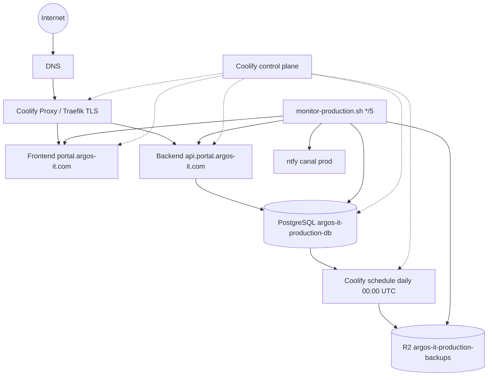
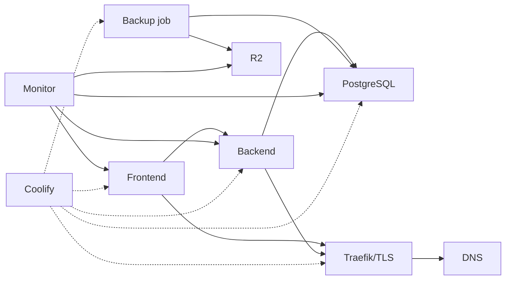
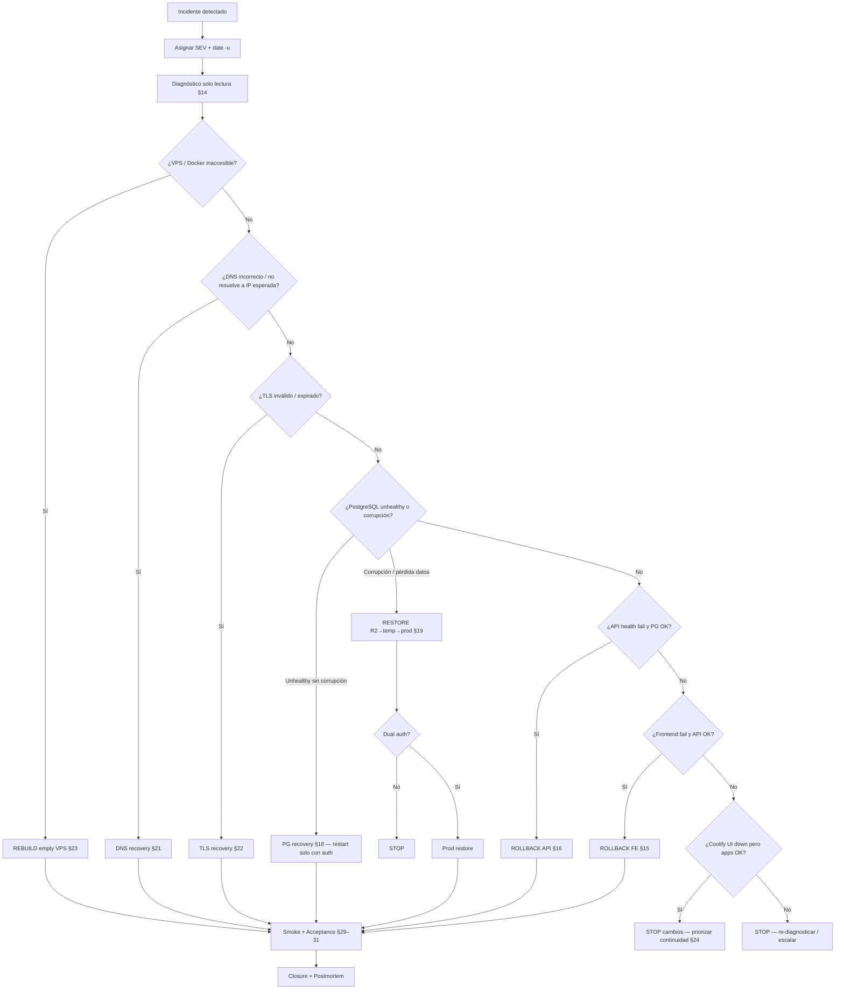
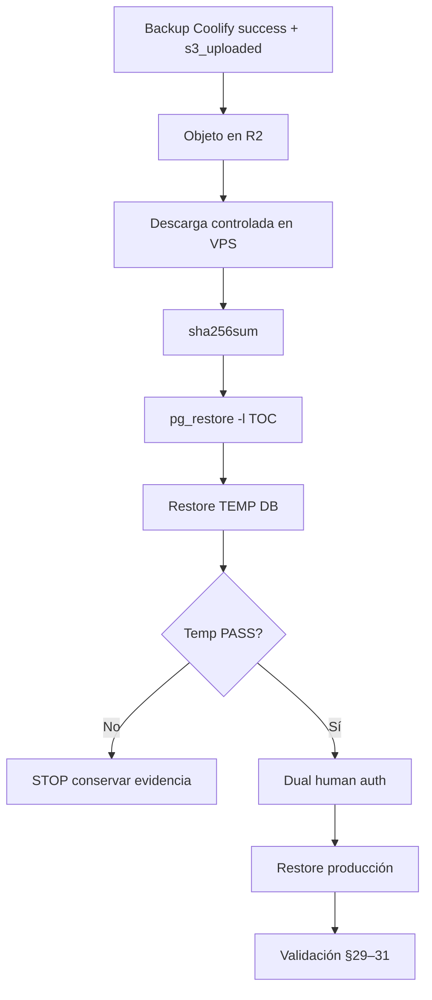
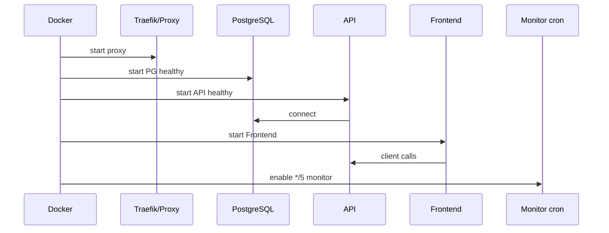
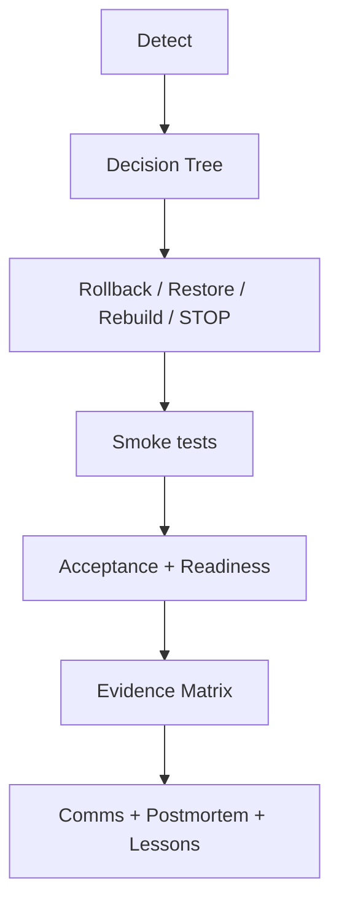

# ARGOS-IT — Production Disaster Recovery Runbook

## Document Control

| Field | Value |
|---|---|
| Document ID | ARGOS-IT-PROD-DR-RUNBOOK |
| Version | **v1.0** |
| Status | **READY FOR DOCUMENT COMMIT** |
| Classification | Internal — Operations / DR |
| Owner | **PENDIENTE** (SRE Lead) |
| Approver | **PENDIENTE** (Incident Commander) |
| Last review (UTC) | 2026-08-02 |
| Next scheduled review | 2026-11-02 (or after any SEV-1/2) |
| Production commit reference | `7be6f06` (`deploy/production-v1`) |
| Scope | Documentation only — does not authorize execution by itself |

## Document History

| Version | Date (UTC) | Author | Summary |
|---|---|---|---|
| v0.1 | 2026-08-02 | SRE / DR docs | Initial runbook (FASE 9) |
| v0.9 | 2026-08-02 | SRE / DR docs | Gap closure: rebuild, secrets metadata, diagrams, checklists |
| v1.0 | 2026-08-02 | SRE / DR docs | Final editorial pass: control block, numbering, auth matrix, refs |

> This document does **not** by itself authorize restores, rollbacks, deploys, or DNS changes.
> All production write actions require authorization per §12.
> Production database restore requires **dual auth** (Incident Commander + DBA).

---

## 1. Executive Summary

| Ítem | Valor |
|---|---|
| Plataforma | Portal ARGOS-IT (frontend + API + PostgreSQL) en Coolify |
| Host verificado | VPS `91.108.121.181` · Coolify `https://coolify.argos-it.com` |
| URLs P0 | `https://portal.argos-it.com` · `https://api.portal.argos-it.com` |
| Offsite | Cloudflare R2 bucket `argos-it-production-backups` |
| RPO recomendado | 24 h (backup Coolify `daily` 00:00 UTC) — **no SLA** |
| RTO recomendado | 2–4 h restauración operativa inicial — **no SLA** |
| Auto-deploy prod | **OFF** (deploy/rollback manual) |
| Monitor | `/root/argos-prod-ops/bin/monitor-production.sh` cada 5 min |
| Fuera de alcance | WordPress / apex / www / correo / MySQL / staging (salvo contraste) |
| Autorización restore prod | Doble humana obligatoria |
| Pendiente operativo | Verificación primer backup automático (FASE 8J ≥ 2026-08-03 00:10 UTC) |

**Cómo usar este runbook**

1. Clasificar SEV → §10
2. Consultar Authorization Matrix → §12
3. Seguir Decision Tree → §13
4. Diagnóstico solo lectura → §14
5. Ejecutar procedimiento (rollback / restore / rebuild)
6. Completar Evidence Matrix → §32
7. Checklists Before → Recovery → Validation → Acceptance → Closure → §30

---

## 2. Propósito

Definir procedimientos reproducibles y seguros para diagnosticar, recuperar, validar y cerrar incidentes del portal productivo ARGOS-IT, incluyendo rebuild desde VPS vacío.

## 3. Alcance

**Incluido**

- Frontend: `https://portal.argos-it.com` (Coolify UUID `rpp5o3j1lvbbq1wjleaqyu91`)
- Backend: `https://api.portal.argos-it.com` (Coolify UUID `ufcwdojnv5wajhllw0df7olg`)
- PostgreSQL: `argos-it-production-db` (UUID `iw42qpqc1w1umsddrl9fwpi9`; DB lógica `postgres`)
- Coolify + Traefik (`coolify-proxy`) en el VPS de producción
- Backups Coolify → R2 `argos-it-production-backups` (storage UUID `qzrnhrzylrp6ngup2ahfalox`)
- Schedule backup UUID `uu5d6t4m6oatofvf4hwl5oeg` (`daily` = `0 0 * * *` UTC)
- Monitor host `/root/argos-prod-ops/`

**Excluido (no tocar salvo orden explícita aparte)**

- WordPress / `https://argos-it.com` / `https://www.argos-it.com`
- Correo · MySQL · Staging (salvo lectura de contraste)
- Cloudflare Observability / Workers (no autorizados)

> Términos operativos: ver §6.

---

## 4. Glossary

| Término | Significado |
|---|---|
| Coolify resource UUID | ID del recurso en Coolify (app/DB/storage/schedule) |
| Container name/ID | Contenedor Docker en el host (a menudo coincide con UUID DB) |
| DB lógica `postgres` | Base dentro del contenedor PG prod — restore prod = alto riesgo |
| DB temporal | `argos_prod_restore_test_<UTC_TIMESTAMP>` — única meta de restore de prueba |
| Dual auth | Autorización de Incident Commander + DBA (ver §12 Authorization Matrix) |
| SEV | Severidad del incidente (1 crítica, 2 degradación, 3 menor) |
| RPO / RTO | Objetivo de pérdida de datos / tiempo de recuperación (recomendaciones, no SLA) |
| Auto-deploy | Redeploy automático por webhook Git; en prod debe permanecer OFF |
| Evidence Matrix | Registro obligatorio de evidencias al cerrar un procedimiento |


## 5. Arquitectura

### 3.1 Diagrama



### 3.2 Inventario verificado

| Recurso | Identificador / URL |
|---|---|
| Coolify UI | `https://coolify.argos-it.com` |
| VPS IP | `91.108.121.181` |
| Frontend UUID | `rpp5o3j1lvbbq1wjleaqyu91` |
| Backend UUID | `ufcwdojnv5wajhllw0df7olg` |
| PostgreSQL UUID | `iw42qpqc1w1umsddrl9fwpi9` |
| DB lógica prod | `postgres` |
| Schedule backup | `uu5d6t4m6oatofvf4hwl5oeg` |
| Storage R2 | `qzrnhrzylrp6ngup2ahfalox` |
| Bucket R2 prod | `argos-it-production-backups` |
| Frecuencia | `daily` → `0 0 * * *` UTC |
| Retención R2 | 30 backups / 30 días |
| Retención local Coolify | `0/0` = cleanup local deshabilitado (ilimitado) |
| Auto-deploy | **OFF** |
| Commit desplegado | `7be6f06` |
| Coolify versión observada | ~v4.1.x — pin exacto **PENDIENTE** |
| Ubuntu / Docker pins | **PENDIENTE** |

---

## 6. Service inventory

| Servicio | Rol | Health | Depende de | Clase datos | Owner |
|---|---|---|---|---|---|
| Frontend | UI portal | HTTP 200 `/` | Traefik, API | Público | **PENDIENTE** |
| Backend API | API + auth | HTTP 200 `/api/health` + `status=OK` | Traefik, PostgreSQL | App + sesión | **PENDIENTE** |
| PostgreSQL | Datos | healthy + `SELECT 1` | Disco/volumen Docker | Críticos | **PENDIENTE** |
| Traefik/proxy | Ingress TLS | HTTPS 200 en hosts | Docker, DNS, LE | Certs | **PENDIENTE** |
| Coolify | Orquestación | UI + containers coolify* | Docker | Control plane | **PENDIENTE** |
| R2 backups | Offsite | `is_usable=true` + objetos | Credenciales storage | Backups | **PENDIENTE** |
| Monitor prod | Detección | cron + log cycle OK | curl, docker, Coolify PHP, ntfy | Operativo | **PENDIENTE** |
| ntfy prod | Alertas | publish HTTP 200 | Topic en host | Operativo | **PENDIENTE** |

---

## 7. Dependency map



| Component | Depends on | Criticality | Recovery order | Failure impact |
|---|---|---|---|---|
| DNS | Registrar / resolvers | P0 | 1 (si cutover IP) | Todo inaccesible por nombre |
| Docker daemon | Host OS | P0 | 1 | Nada corre |
| Traefik / coolify-proxy | Docker, DNS, certs | P0 | 2 | Sin HTTPS / routing |
| PostgreSQL | Docker, volumen | P0 | 3 | API caída; riesgo datos |
| Backend API | Traefik, PG | P0 | 4 | Portal no funcional |
| Frontend | Traefik, API | P0 | 5 | UI caída |
| Backup schedule | Coolify, PG, R2 | P1 | 6 | RPO roto |
| R2 storage | Credenciales, red | P1 | 6 | Sin offsite |
| Monitor + ntfy | Host cron, red | P1 | 7 | Detección ciega |
| Staging | (aislado) | P3 | n/a | Contraste solo |
| WordPress apex | (excluido) | n/a | **NO TOCAR** | Fuera de DR portal |

---

## 8. Critical path

**Orden crítico de recuperación de producción (path mínimo para servicio online):**

```text
1. Host + Docker UP
2. Traefik/proxy enruta TLS a FE/API
3. PostgreSQL running:healthy + SELECT 1
4. API /api/health → 200 status=OK
5. Frontend / → 200
6. (post) Schedule backup + R2 usable + monitor cron
```

Cualquier restore de datos ocurre **entre** pasos 3 y 4, solo tras temp PASS + dual auth.

---

## 9. Recovery priorities (P0–P3)

| Prioridad | Qué | Acción típica |
|---|---|---|
| **P0** | API, Frontend, PostgreSQL, TLS portal/API | Restore/rollback/rebuild inmediato |
| **P1** | Backups R2, schedule, monitor, Coolify control plane | Restaurar RPO/detección en misma ventana |
| **P2** | Disco local de dumps, ntfy delivery cosmetics | Tras P0/P1 estables |
| **P3** | Staging contraste, IA/OpenAI vacía, Socket.IO off, UX no bloqueante | Fuera de ventana SEV-1 |

---

## 10. Clasificación de incidentes (SEV)

### SEV-1

- Producción totalmente caída
- DB inaccesible / pérdida / corrupción
- TLS roto en frontend **y** API
- VPS inaccesible sin recuperación rápida

### SEV-2

- API degradada; frontend parcial
- Backups fallando / R2 unusable / `s3_uploaded=false`
- Reinicios repetidos

### SEV-3

- Warning no bloqueante; UX; alerta falsa; integración no crítica

---

## 11. RPO y RTO

### RECOMENDACIÓN OPERATIVA (no contractual)

| Métrica | Valor | Base |
|---|---|---|
| RPO | 24 h | Backup `daily` 00:00 UTC + R2 30/30 |
| RTO | 2–4 h | Diagnóstico + restore temporal + cutover controlado |

Hasta FASE 8J PASS, el RPO **automático** diario no se da por demostrado; existe evidencia de backup **manual** E2E validado.

---


## 12. Authorization Matrix

| Action | Authorization required |
|---|---|
| Read-only diagnosis | 1 operator (SSH) |
| Restart single container (FE/API/DB) | 1 operator + written approval |
| Rollback Frontend | 1 operator |
| Rollback API | 1 operator |
| TLS re-issue / Traefik cert renewal | 1 operator + written approval |
| R2 storage config change | 1 operator + written approval |
| Schedule enable/disable / retention change | 1 operator + written approval |
| Restore to temporary database | 1 operator + written approval |
| Restore onto production database | Incident Commander + DBA (**dual auth**) |
| DNS cutover / IP change | Dual authorization |
| Empty VPS rebuild | Dual authorization |
| Coolify control-plane rebuild | Dual authorization |
| Traefik/proxy full rebuild | Dual authorization |
| Touch WordPress / apex / www / mail / MySQL | **Forbidden** unless separate explicit order |

All write procedures must record operator + reviewer in §32.

## 13. Decision Tree



| Síntoma | Destino |
|---|---|
| Frontend ≠ 200, API OK | Rollback FE |
| API health fail, PG OK | Rollback API |
| PG corrupción / pérdida | Restore |
| TLS roto | TLS recovery |
| DNS / IP incorrecta | DNS recovery |
| VPS muerto | Rebuild |
| Pérdida total infra | Rebuild |
| Evidencia insuficiente / sin auth | **STOP** |

---

## 14. Diagnóstico inicial (solo lectura)

**Purpose:** Clasificar fallo sin mutar estado.
**Required permissions:** SSH lectura/ejecución no destructiva.
**Required access:** SSH VPS, red saliente a URLs públicas.
**Required tools:** `curl`, `docker`, `openssl`, `dig`, `psql` vía `docker exec`.
**Expected duration:** 10–20 min.
**Operational risk:** Bajo (solo lectura).
**Rollback available:** N/A.
**Prerequisites:** Acceso SSH; no ejecutar restart/deploy/restore aquí.

**Acceptance criteria:** SEV clasificado; Decision Tree destino elegido; sin mutaciones.
**Evidence:** Completar §32.

```bash
date -u
uptime
free -h
df -h
docker ps -a
docker inspect --format '{{.Name}} status={{.State.Status}} health={{if .State.Health}}{{.State.Health.Status}}{{else}}n/a{{end}} restarts={{.RestartCount}}' \
  iw42qpqc1w1umsddrl9fwpi9
docker logs --tail 200 <container_id_or_name>
ss -lntp
curl -fsS -o /dev/null -w '%{http_code}\n' https://portal.argos-it.com/
curl -fsS https://api.portal.argos-it.com/api/health
echo | openssl s_client -servername portal.argos-it.com -connect portal.argos-it.com:443 2>/dev/null | openssl x509 -noout -dates -subject -issuer
echo | openssl s_client -servername api.portal.argos-it.com -connect api.portal.argos-it.com:443 2>/dev/null | openssl x509 -noout -dates -subject -issuer
dig +short portal.argos-it.com
dig +short api.portal.argos-it.com
docker exec -u postgres iw42qpqc1w1umsddrl9fwpi9 pg_isready
docker exec -u postgres iw42qpqc1w1umsddrl9fwpi9 psql -d postgres -Atc 'SELECT 1'
tail -n 50 /root/argos-prod-ops/logs/monitor-$(date -u +%Y%m%d).log
crontab -l | grep argos-prod-ops
```

**Filtros útiles:** API `ufcwdojnv5wajhllw0df7olg` · Web `rpp5o3j1lvbbq1wjleaqyu91` · DB `iw42qpqc1w1umsddrl9fwpi9`

---

## 15. Frontend recovery / rollback

**Purpose:** Restaurar UI portal sin tocar DB.
**Required permissions:** Coolify deploy/rollback FE.
**Required access:** Coolify UI · HTTPS check.
**Required tools:** Coolify UI, curl, navegador.
**Expected duration:** 15–45 min.
**Operational risk:** Medio (cambio de build servido).
**Rollback available:** YES (otro deployment previo).
**Prerequisites:** API healthy; auto-deploy OFF; SEV atribuible a FE; autorización escrita.

**Acceptance criteria:** Portal HTTP 200; TLS OK; login/dashboard OK; API healthy.
**Evidence:** Completar §32.

1. Coolify → Application Web `rpp5o3j1lvbbq1wjleaqyu91` → Deployments
2. Elegir deployment sano (fecha + commit)
3. Confirmar commit en GitHub
4. Rollback / redeploy manual
5. Validar: `/` 200, TLS, login/dashboard redirect, assets, consola
6. Confirmar API sigue healthy
7. Completar Evidence Matrix (§32)

**No hacer:** tocar WordPress apex/www; redeploy “por si acaso”.

---

## 16. Backend recovery / rollback

**Purpose:** Restaurar API.
**Required permissions:** Coolify deploy/rollback API.
**Required access:** Coolify UI · health endpoint.
**Required tools:** Coolify UI, curl, docker logs.
**Expected duration:** 20–60 min.
**Operational risk:** Medio-Alto (auth/rate-limit).
**Rollback available:** YES.
**Prerequisites:** PostgreSQL healthy + `SELECT 1`; auto-deploy OFF; autorización.

**Acceptance criteria:** API 200 + status=OK; smoke auth/lectura OK; PG intacto.
**Evidence:** Completar §32.

1. Si DB falla → §18/§19 primero
2. Coolify → API `ufcwdojnv5wajhllw0df7olg` → Deployments
3. Deployment sano + commit verificado (`7be6f06` u otro)
4. Rollback manual
5. Contenedor `healthy`
6. `curl -fsS https://api.portal.argos-it.com/api/health` → 200 + `status=OK`
7. Smoke auth/lectura (§29)
8. Confirmar PG intacto (sin migraciones destructivas)
9. Evidence Matrix

**Nota:** trust proxy fijado en commit `7be6f06`.

---

## 17. Execution Time Matrix

Estimaciones operativas (no SLA):

| Procedimiento | Estimación |
|---|---|
| Frontend rollback | 15–45 min |
| Backend rollback | 20–60 min |
| Database restore (temp + validate) | 30–90 min |
| Database restore onto production (tras dual auth) | +30–120 min |
| TLS recovery | 20–90 min |
| DNS recovery | 15 min – 48 h (TTL/propagación) |
| Empty VPS rebuild | 4–12 h |
| Complete DR validation | 30–60 min |
| Postmortem draft | 1–3 h |

---

## 18. PostgreSQL unhealthy (sin corrupción confirmada)

**Purpose:** Recuperar motor PG.
**Required permissions:** Docker/Coolify DB restart (auth).
**Required access:** SSH + Coolify.
**Required tools:** docker inspect/logs, pg_isready.
**Expected duration:** 15–60 min.
**Operational risk:** Alto (corta API).
**Rollback available:** NO (restart no es rollback de datos).
**Prerequisites:** Diagnóstico §14; autorización restart; comprobar disco.

**Acceptance criteria:** PG healthy; pg_isready OK; SELECT 1 OK; API health OK.
**Evidence:** Completar §32.

```bash
docker inspect --format 'status={{.State.Status}} health={{.State.Health.Status}} restarts={{.RestartCount}}' iw42qpqc1w1umsddrl9fwpi9
docker logs --tail 200 iw42qpqc1w1umsddrl9fwpi9
docker exec -u postgres iw42qpqc1w1umsddrl9fwpi9 pg_isready
df -h
docker inspect -f '{{range .Mounts}}{{.Source}} -> {{.Destination}}{{println}}{{end}}' iw42qpqc1w1umsddrl9fwpi9
```

1. Disco lleno → liberar **sin** borrar único backup válido sin inventario
2. Restart contenedor DB **solo con autorización**
3. Si corrupción → §19
4. Nunca `DROP`/`TRUNCATE`/`DELETE` de datos de aplicación

---

## 19. PostgreSQL corrupción / restore desde R2

### 19.1 Flujo obligatorio



### 19.2 Restore desde R2

**Purpose:** Obtener dump íntegro offsite.
**Required permissions:** Lectura R2 vía Coolify/storage host.
**Required access:** SSH; Coolify S3 usable.
**Required tools:** Coolify/Storage o cliente S3 ya configurado; sha256sum; pg_restore.
**Expected duration:** 20–60 min.
**Operational risk:** Bajo-Medio (solo descarga).
**Rollback available:** N/A.
**Prerequisites:** Storage `is_usable=true`; bucket correcto; no imprimir credenciales.

**Acceptance criteria:** Objeto descargado; size>0; SHA256 registrado; TOC legible.
**Evidence:** Completar §32.

```bash
# TOC (patrón verificado)
docker run --rm -v /path/to/dir:/work:ro postgres:16-alpine \
  pg_restore -l /work/<dump>.dmp
sha256sum /path/to/<dump>.dmp
```

**Muestra histórica (no usar como objeto actual del incidente):**

| Campo | Valor |
|---|---|
| Execution UUID | `uyl6bxo6b5cuw6y06bm087jq` |
| Finished | 2026-08-02 13:23:20 UTC |
| Size | 38241 B |
| SHA256 | `4a8fa91c12bfafea585147433f1ba0110dfb77e53f4747b0ee7818b504be8885` |
| Formato | PostgreSQL custom v1.15-0 (PG 16.14) |
| ETag | `cc0ff4e4d6376f71817cddff60163587` |

### 19.3 Restore en base temporal

**Purpose:** Probar utilizabilidad del dump.
**Required permissions:** `CREATE DATABASE` en instancia PG prod host.
**Required access:** SSH docker exec.
**Required tools:** pg_restore, psql.
**Expected duration:** 15–45 min.
**Operational risk:** Medio (mismo host; target debe ser SOLO temporal).
**Rollback available:** YES (DROP solo DB temporal tras PASS/FAIL forense).
**Prerequisites:** Dump hasheado; nombre `argos_prod_restore_test_<UTC_TIMESTAMP>`; **prohibido** target `postgres` prod.

**Acceptance criteria:** Temp PASS; tablas críticas presentes; sin restore sobre postgres prod.
**Evidence:** Completar §32.

```bash
docker exec -u postgres iw42qpqc1w1umsddrl9fwpi9 \
  psql -d postgres -v ON_ERROR_STOP=1 \
  -c "CREATE DATABASE argos_prod_restore_test_<TS> OWNER postgres;"

docker exec -u postgres iw42qpqc1w1umsddrl9fwpi9 \
  pg_restore --dbname=argos_prod_restore_test_<TS> --verbose --exit-on-error /tmp/<dump>.dmp
```

Sin `--clean` / `--create` / `--if-exists`. Si falla: **STOP**.

**Validación temp mínima**

- `SELECT 1`
- 12 tablas `public` (evidencia 8G):
  `activity_logs`, `ai_memory`, `client_diagnostics`, `client_improvements`, `client_messages`, `client_services`, `form_submissions`, `refresh_sessions`, `security_logs`, `services`, `users`, `website_audits`
- Sin PII en reportes

### 19.4 Restore sobre producción

### NO EJECUTAR SIN AUTORIZACIÓN HUMANA DOBLE

> Authorization: ver §12 (Incident Commander + DBA).

**Purpose:** Sobrescribir/recuperar datos prod.
**Required permissions:** Dual auth IC + DBA (matriz §12).
**Required access:** SSH; mantenimiento apps.
**Required tools:** pg_restore; ventana mantenimiento.
**Expected duration:** 30–120 min + validación.
**Operational risk:** **Crítico**.
**Rollback available:** LIMITED (solo otro backup previo).
**Prerequisites:** SEV-1; temp PASS; SHA256/TOC OK; snapshot actual si posible; apps en mantenimiento; plan documentado; dual auth escrita.

**Acceptance criteria:** Dual auth registrada; PG+API+FE healthy; Readiness PASS.
**Evidence:** Completar §32.

**Barreras:** DB lógica se llama `postgres`; no staging; no WordPress/MySQL.

Tras restore: `pg_isready` → API → FE → §29–§31 → schedule + monitor.

---

## 20. Object storage (R2) recovery

**Purpose:** Recuperar capacidad offsite / acceso a objetos.
**Required permissions:** Coolify storage admin.
**Required access:** Coolify UI / host storage config.
**Required tools:** Coolify `is_usable` test.
**Expected duration:** 30–120 min.
**Operational risk:** Medio (RPO). Servicio online puede seguir.
**Rollback available:** YES (revertir config storage).
**Prerequisites:** No rotar secretos sin plan; no tocar bucket staging.

**Acceptance criteria:** Storage is_usable=true; bucket prod correcto; schedule conforme política.
**Evidence:** Completar §32.

1. Verificar storage UUID `qzrnhrzylrp6ngup2ahfalox`, bucket `argos-it-production-backups`
2. `is_usable=true`
3. Si R2 prolongado: sink alternativo **PENDIENTE**; dumps locales Coolify (retención 0/0 = riesgo disco)
4. Schedule: no desactivar sin auth; `enabled=false` inesperado = SEV-2

---

## 21. DNS recovery

**Purpose:** Restaurar resolución correcta a IP de servicio.
**Required permissions:** Acceso DNS del dominio (**PENDIENTE** registrar/panel).
**Required access:** Panel DNS + dig.
**Required tools:** dig, curl, openssl.
**Expected duration:** 15 min–48 h.
**Operational risk:** Alto (corte global).
**Rollback available:** YES (revertir registros/TTL).
**Prerequisites:** Dual auth para cutover IP; inventario registros **PENDIENTE**; no tocar apex WordPress salvo orden aparte.

**Acceptance criteria:** dig = IP esperada; portal+API 200; TLS válido.
**Evidence:** Completar §32.

1. `dig +short portal.argos-it.com` / `api.portal.argos-it.com` / `coolify.argos-it.com`
2. Comparar con IP esperada (`91.108.121.181` u otra autorizada post-rebuild)
3. Ajustar registros A/AAAA/CNAME según inventario **PENDIENTE**
4. Esperar TTL; validar dig multi-resolver
5. Validar HTTPS health
6. Si falla → rollback DNS

---

## 22. TLS recovery

**Purpose:** Certificados válidos en portal y API.
**Required permissions:** Coolify/Traefik cert management.
**Required access:** Coolify UI, SSH logs proxy.
**Required tools:** openssl, curl, docker logs proxy.
**Expected duration:** 20–90 min.
**Operational risk:** Alto (HTTPS).
**Rollback available:** LIMITED.
**Prerequisites:** DNS correcto; puerto 443 reachable; no regenerar certs sin causa.

**Acceptance criteria:** openssl dates/issuer OK; portal+API HTTPS 200.
**Evidence:** Completar §32.

```bash
echo | openssl s_client -servername portal.argos-it.com -connect portal.argos-it.com:443 2>/dev/null | openssl x509 -noout -dates -issuer
docker ps --filter name=coolify-proxy
```

1. No cambiar DNS “para probar”
2. Revisar logs `coolify-proxy`
3. Renovar/reemitir vía Coolify/Traefik con autorización
4. Alerta monitor si quedan menos de 14 días
5. Validar hostname + issuer + health

---

## 23. Empty VPS rebuild (complete)

**Purpose:** Reconstruir producción desde host vacío.
**Required permissions:** Proveedor VPS, DNS dual auth, vault secretos, Coolify admin.
**Required access:** Consola proveedor, SSH nuevo host, GitHub, R2 vía Coolify, vault.
**Required tools:** Ubuntu installer, Docker, Coolify installer, pg_restore.
**Expected duration:** 4–12 h.
**Operational risk:** Crítico.
**Rollback available:** LIMITED (mantener VPS viejo si existe hasta cutover).
**Prerequisites:** Inventario secretos (§25); objeto R2 válido; commit sano; plan DNS; WordPress **no** incluido.

**Acceptance criteria:** Critical path §8 completo; Readiness checklist PASS.
**Evidence:** Completar §32.

| Paso | Acción | Pin / nota |
|---|---|---|
| 1 | Provisionar VPS | Proveedor/datacenter **PENDIENTE** |
| 2 | Instalar Ubuntu LTS | Versión exacta **PENDIENTE** |
| 3 | SSH key-only; usuario ops | Hardening detallado = fase separada |
| 4 | Instalar Docker Engine + Compose plugin | Versión **PENDIENTE** |
| 5 | Instalar Coolify | ~v4.1.x observada; pin **PENDIENTE** |
| 6 | Verificar `coolify`, `coolify-proxy`, `coolify-db`, `coolify-redis` | |
| 7 | Conectar GitHub source | **auto-deploy OFF** |
| 8 | Recrear PostgreSQL standalone vacío | UUID nuevo ≠ antiguo |
| 9 | Resta secretos desde vault (§25) | Nunca en Git |
| 10 | Registrar S3 storage → bucket `argos-it-production-backups` | `is_usable=true` |
| 11 | Restore DB: R2 → temp → dual auth → prod | §19 |
| 12 | Deploy API luego Frontend en commit sano | Orden crítico §8 |
| 13 | TLS vía Traefik/LE | §22 |
| 14 | DNS cutover con dual auth | §21 |
| 15 | Recrear `/root/argos-prod-ops` + cron `*/5` + ntfy topic nuevo | Topic no en doc |
| 16 | Smoke + Acceptance + Readiness | §29–§31 |
| 17 | Confirmar apex/WordPress intactos | Fuera de alcance |

### 23.1 Coolify rebuild (dedicado)

**Purpose:** Reponer control plane.
**Prerequisites:** Docker UP; backup/export Coolify **PENDIENTE**; apps pueden seguir vía Traefik si proxy intacto.

1. Si solo UI caída y apps OK → **STOP** reinicios en cascada
2. Restaurar export Coolify si existe (**PENDIENTE** ubicación)
3. Si no: reinstalar Coolify; recrear resources desde inventario §6
4. Re-vincular GitHub; auto-deploy OFF
5. Re-vincular storage R2; re-crear schedule con retención 30/30
6. CLI Coolify playbook exacto **PENDIENTE**

### 23.2 Traefik / proxy rebuild (dedicado)

**Purpose:** Restaurar ingress TLS.
**Prerequisites:** Docker UP; dominios portal/api; DNS OK.

1. Asegurar contenedor `coolify-proxy`
2. Recrear labels/dominios FE+API desde inventario — **no** rutas WordPress apex
3. Forzar re-issue certs solo con auth
4. Validar openssl + curl 200

---

## 24. Coolify inaccesible (incidente, no rebuild)

**Purpose:** Continuar servicio si control plane falla.
**Risk:** Medio. **Rollback:** N/A.

1. UI down ≠ apps down — verificar FE/API/PG primero
2. Proxy down → §22/§23.2
3. Coolify DB interna → procedimiento vendor **PENDIENTE**; priorizar portal

---


**Acceptance criteria:** FE/API/PG healthy sin cambios destructivos innecesarios.
**Evidence:** Completar §32.
## 25. Secrets metadata inventory

**Nunca documentar valores.**

| Service | Purpose | Storage location | Recovery method | Owner | Rotation policy | Status |
|---|---|---|---|---|---|---|
| PostgreSQL prod password | Auth DB | Coolify resource / env encriptado | Coolify UI recover / vault operador | **PENDIENTE** | **PENDIENTE** | Existe |
| API JWT secret | Firmas access | Coolify env app API | Vault → re-set Coolify env + redeploy | **PENDIENTE** | **PENDIENTE** | Existe |
| API JWT refresh secret | Refresh tokens | Coolify env app API | Vault → re-set + redeploy | **PENDIENTE** | **PENDIENTE** | Existe |
| R2 access key | Backups S3 | Coolify S3Storage encrypted + host `/root/.argos-r2.env` (600) | Reissue CF token → update Coolify storage | **PENDIENTE** | **PENDIENTE** | Existe |
| R2 secret key | Backups S3 | Idem | Idem | **PENDIENTE** | **PENDIENTE** | Existe |
| ntfy prod topic | Alertas | `/root/argos-prod-ops/keys/ntfy-topic` mode 600 | Generar topic nuevo; actualizar monitor | **PENDIENTE** | Tras fuga | Existe |
| SSH host keys / operator key | Admin VPS | Workstation operador + `~/.ssh` host | Reissue keys; actualizar proveedor | **PENDIENTE** | **PENDIENTE** | Existe |
| GitHub App / deploy key | Source Coolify | Coolify source config | Reinstall GitHub App | **PENDIENTE** | **PENDIENTE** | Existe |
| Coolify admin credentials | UI | Operador vault | Reset Coolify admin | **PENDIENTE** | **PENDIENTE** | Existe |
| Let's Encrypt / ACME | TLS | Traefik/Coolify volumes | Re-issue certs | **PENDIENTE** | Auto renew | Existe |
| OpenAI / Socket secrets | Integraciones no críticas | Coolify env (si aplica) | Vault; P3 | **PENDIENTE** | **PENDIENTE** | Puede estar vacío |
| Staging secrets | Fuera DR prod | `/root/.argos-staging-secrets/` | No usar en prod | **PENDIENTE** | n/a | Aislado |

---

## 26. Backup inventory

| Ítem | Valor |
|---|---|
| Schedule UUID | `uu5d6t4m6oatofvf4hwl5oeg` |
| enabled / save_s3 / frequency | true / true / daily (`0 0 * * *` UTC) |
| Storage / bucket | `qzrnhrzylrp6ngup2ahfalox` / `argos-it-production-backups` |
| Retención R2 | 30 amount + 30 days |
| Retención local | 0/0 → **ilimitada** (cleanup off) |
| Formato dump | PostgreSQL custom (`pg_dump --format=custom`) |
| Prefijo objeto R2 típico | `data/coolify/backups/databases/.../pg-dump-postgres-<ts>.dmp` |
| Local pattern (Coolify host) | bajo `backup_dir` Coolify / path tipo `/data/coolify/backups/databases/...` |
| Verification | Coolify execution `success` + `s3_uploaded=true` + size>0 + monitor age < 36h |
| Integrity | sha256sum + `pg_restore -l` + restore temp |
| Restore source priority | 1) R2 objeto del incidente 2) local Coolify si R2 caído 3) dump histórico solo si es el correcto |
| Pending | FASE 8J primer automático; política local 7–14 días **no aplicada** |

---

## 27. Accesos necesarios

| Acceso | Uso | Notas |
|---|---|---|
| SSH root VPS | docker, logs, monitor, dumps | Clave no en doc |
| Coolify admin | deploy/rollback/DB/S3 | |
| R2 vía Coolify | list/download backups | |
| GitHub | commits | auto-deploy OFF |
| Vault operador | secretos rebuild | inventario §25 |
| Panel DNS | cutover | **PENDIENTE** |
| ntfy | alertas | topic no publicar |

**Escalación (placeholders)**

| Rol | Persona / canal | Estado |
|---|---|---|
| Incident Commander | **PENDIENTE** | |
| SRE | **PENDIENTE** | |
| DBA | **PENDIENTE** | |
| Negocio | **PENDIENTE** | |

---

## 28. Precondiciones generales de recuperación

1. SEV + timeline UTC
2. Blast radius WordPress/staging leído
3. Auto-deploy OFF
4. Commit/deployment sano identificado
5. Si datos: objeto R2 + execution UUID
6. Si prod restore: dual auth
7. Canal de comunicación abierto

---

## 29. Smoke tests

| # | Test | Comando / acción | Esperado |
|---|---|---|---|
| 1 | Portal | `curl -fsS -o /dev/null -w '%{http_code}' https://portal.argos-it.com/` | 200 |
| 2 | API health | `curl -fsS https://api.portal.argos-it.com/api/health` | 200 + `"status":"OK"` |
| 3 | PG ready | `docker exec -u postgres iw42qpqc1w1umsddrl9fwpi9 pg_isready` | accept connections |
| 4 | PG select | `... psql -d postgres -Atc 'SELECT 1'` | `1` |
| 5 | TLS portal | openssl enddate/issuer | válido; > 14 días ideal |
| 6 | TLS API | idem | válido |
| 7 | DNS | dig portal + api | IP esperada |
| 8 | Login UI | navegador | formulario / redirect OK |
| 9 | Dashboard | post-login | carga sin 5xx |
| 10 | Monitor | último `monitor_cycle_done` | presente; sin ALERT crítico |
| 11 | Backup schedule | Coolify fields | enabled + save_s3 |
| 12 | R2 | is_usable + count≥1 tras backup | true |
| 13 | Staging contrast | staging web/API | 200/200 |
| 14 | WordPress | apex/www | 200/301 típico; intacto |

---

## 30. Operational checklists

### Before recovery

- [ ] `date -u` registrado
- [ ] SEV asignado
- [ ] IC identificado
- [ ] Decision Tree seguido
- [ ] Auto-deploy OFF
- [ ] Blast radius leído
- [ ] Procedimiento elegido: Rollback / Restore / Rebuild / STOP

### Recovery

- [ ] Permisos/auth obtenidos
- [ ] Solo target autorizado
- [ ] IDs registrados (deploy/backup/object)
- [ ] Si DB: hash + TOC + temp PASS
- [ ] Si prod restore: dual auth
- [ ] Staging/WordPress no modificados

### Validation

- [ ] Smoke §29 #1–7 PASS
- [ ] Restart counts estables
- [ ] Logs sin error crítico recurrente

### Acceptance

- [ ] Smoke §29 #8–12 PASS
- [ ] Readiness §31 PASS
- [ ] Evidence Matrix completa

### Rollback validation

- [ ] Deployment/commit ID documentado
- [ ] Health del servicio rolled-back OK
- [ ] Peer service OK
- [ ] Sin migraciones inesperadas

### Closure

- [ ] Comunicación enviada
- [ ] Postmortem programado
- [ ] Evidence archivada
- [ ] Follow-ups con owner + fecha

---

## 31. Operational Readiness Checklist

Ejecutar tras **cada** recovery, deploy, rollback o mantenimiento autorizado:

- [ ] Portal 200
- [ ] API 200 + status OK
- [ ] PG healthy
- [ ] TLS OK
- [ ] Login + dashboard
- [ ] Auto-deploy OFF
- [ ] Backup schedule conforme política
- [ ] R2 usable
- [ ] Monitor cron activo
- [ ] Disco no crítico
- [ ] Staging intacto
- [ ] WordPress intacto
- [ ] Evidence Matrix firmada (operator + reviewer)

---

## 32. Evidence Matrix (obligatoria al cerrar cada procedimiento)

| Campo | Valor (rellenar) |
|---|---|
| Procedimiento | |
| SEV | |
| UTC start | |
| UTC end | |
| Operator | |
| Reviewer | |
| Authorization ref | |
| Deployment UUID(s) | |
| Git commit | |
| Backup execution UUID | |
| R2 object key (parcial) | |
| SHA256 | |
| Temp DB name | |
| Health portal | |
| Health API body/status | |
| PG health | |
| Smoke §29 result | |
| Acceptance §31 result | |
| Deviations / STOP reasons | |

Nunca incluir passwords, tokens, topics ntfy, R2 keys, JWT.

---

## 33. Comunicación del incidente

| Audiencia | Contenido | Canal |
|---|---|---|
| SRE interno | SEV, impacto, ETA, acciones | **PENDIENTE** |
| Negocio | impacto usuario, ETA | **PENDIENTE** |
| Público | solo si aplica | **PENDIENTE** plantilla |

Incluir hora UTC, servicios afectados, pérdida de datos sí/no, próxima update. Sin secretos.

---

## 34. Postmortem template

1. Timeline UTC
2. Causa raíz
3. Impacto
4. Detección
5. Resolución
6. Acciones preventivas (owner + due date)
7. Evidencia (UUIDs, hashes)
8. SEV final

---

## 35. Lessons learned (estructura permanente)

| Campo | Entrada |
|---|---|
| Incident ID | |
| Date UTC | |
| What went well | |
| What failed | |
| Detection gap | |
| Runbook gap | |
| Action items | |
| Owners / due dates | |
| Runbook sections updated | |

---

## 36. Future improvements (separado de riesgos)

| Mejora | Beneficio | Estado |
|---|---|---|
| Completar owners/contactos §27 | Escalado real | PENDIENTE |
| Pins Ubuntu/Docker/Coolify | Rebuild reproducible | PENDIENTE |
| Export periódico config Coolify | Coolify rebuild | PENDIENTE |
| Inventario DNS registros | DNS recovery ejecutable | PENDIENTE |
| Política retención local 7–14 días | Mitigar disco | PENDIENTE auth |
| Verificar backup automático 8J | Demostrar RPO diario | PENDIENTE ventana |
| Mapa co-tenancy WordPress/staging | Evitar daño colateral | PENDIENTE |
| Playbook CLI Coolify | UI outage | PENDIENTE |
| Drill restore temp trimestral | Madurez DR | PENDIENTE |
| Hardening puertos admin | Seguridad | Fase separada autorizada |

---

## 37. Riesgos y limitaciones conocidos

- RPO automático diario no demostrado hasta 8J PASS
- Retención local 0/0 = crecimiento ilimitado
- Posible co-tenancy staging/WordPress en mismo VPS
- ntfy topic en disco (600); rotar si fuga
- Cloudflare Observability no autorizada
- Secret owners/rotation policies incompletos
- Sin SLA contractual en este documento

---

## 38. Revisión periódica

| Actividad | Frecuencia |
|---|---|
| Revisar runbook | Trimestral o post SEV-1/2 |
| Drill restore temporal | Trimestral |
| Verificar schedule + R2 | Tras cambios backup |
| Alerta sintética ntfy | Tras cambios monitor |
| Rotar accesos | Según política **PENDIENTE** |

---

## 39. Startup order



Orden: Docker → Traefik → PostgreSQL → API → Frontend → Monitor.

---

## 40. Recovery workflow (resumen visual)



---

## 41. Estado documental

| Ítem | Estado |
|---|---|
| Runbook self-contained objetivo | v1.0 editorial complete; operational PENDIENTE fields remain as placeholders |
| Restore/rollback reales | No ejecutados desde este doc (correcto) |
| 8J auto backup | PENDIENTE |
| Hardening | Fuera de alcance; requiere autorización aparte |

---

**Fin del runbook.**
Ningún procedimiento de escritura se ejecuta sin autorización explícita fuera de este archivo.
