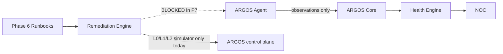

# ARGOS Phase 7 — Architecture

```
STATUS = PLANNING_ONLY
IMPLEMENTATION_AUTHORIZED = NO
```

---

## 1. CURRENT reconstruction (Phases 0–6 @ `9a5e8cd`)

| Layer | CURRENT |
|-------|---------|
| Orgs / memberships / roles | DONE — `admin\|super_admin` global; `org_admin` tenant |
| Assets / TLS | DONE — tenant-scoped |
| Monitors / checks / observations | DONE — HTTP/TLS/DNS; `source IN ('PLATFORM','AGENT')` reserved |
| Health / alerts / incidents | DONE — `healthEngine`; UNKNOWN first-class |
| Client portal `/dashboard` | DONE — tenant UI |
| NOC `/noc` + `/api/noc` | DONE — staff cross-tenant read + Phase 6 remediation mutations |
| Runbooks / remediation | DONE — typed registry; L4 blocked; no customer infra mutation |
| Agents tables / APIs | **NOT_IMPLEMENTED** — NOC `/noc/agents` = `NOT_AVAILABLE_YET` |
| CHICO as security persona in portal chrome | **NOT_IMPLEMENTED** — public/assistant CHICO exists as «perro guardián» / security; Design Contract still `ASSISTANT_ONLY` |

### CURRENT data path

```
Asset → Monitor (PLATFORM) → Observation → Health → Alert → Incident
                                              ↓
                                    Client + NOC visibility
                                              ↓
                              Runbook plan → Dry-run → (L3 Approval) → Execute → Verify
```

Agents are a **parallel observation feeder**, not a bypass of this chain.

---

## 2. TARGET Phase 7 addition

```
Customer host
   → ARGOS Agent (outbound TLS only)
   → /api/agent/v1/* (NEW — proposed)
   → identity + tenant + asset + capability + anti-replay
   → normalize / idempotent write
   → observations (source=AGENT) OR agent_observations → projector
   → existing healthEngine / alerts / incidents
   → Client (honest status) + NOC Agents UI
```

---

## 3. Trust boundaries

| Zone | Trust |
|------|-------|
| Customer host | Untrusted (may be compromised) |
| Agent process | Semi-trusted sensor; least privilege |
| Network path | TLS; assume MITM without TLS |
| ARGOS ingest | Authenticates; never trusts body org/asset claims blindly |
| ARGOS DB | Source of binding truth |
| NOC operator | Trusted staff; still audited |
| Client user | Tenant-scoped; no agent admin |

---

## 4. Identity model (proposed)

### Entities

- **Enrollment:** one-time token, org+asset+capabilities scoped, TTL, hashed at rest.
- **Agent:** durable id, org_id, asset_id, status, last_seen_at, metadata (safe).
- **Credential:** rotatable secret (hash stored); versioned; revoke list.
- **Capabilities:** allowlist strings on enrollment + credential.

### Policy answers

| Question | Recommendation |
|----------|----------------|
| One agent → multiple assets? | **NO in Phase 7** (1:1 agent↔primary asset). Multi-asset = FUTURE |
| One asset → multiple agents? | **YES** (e.g. dual host / replacement); NOC must disambiguate |
| Agent move organizations? | **NO** — revoke + new enrollment |
| Asset deleted? | Cascade or revoke agents; stop ingest |
| Org deleted? | Cascade enrollments/agents |
| Rotation failure? | Keep previous cred valid until new confirmed **or** dual-accept window; if both fail → agent OFFLINE + human |
| Cloned agent? | Detect via overlapping seq / concurrent device claims → force revoke (hardening) |
| Re-enrollment? | New enrollment token; old credential revoked |

---

## 5. Enrollment flow (design)

1. NOC admin creates enrollment (org, asset, capabilities, TTL).
2. ARGOS stores **hash(token)**, status=`PENDING`, single-use.
3. Operator installs agent with token (out-of-band).
4. Agent `POST /api/agent/v1/enroll` outbound.
5. Server validates hash, expiry, not consumed, org/asset exist & match.
6. **Atomic** consume token (transaction / unique constraint).
7. Issue operational credential (return once); store hash.
8. Agent stores secret locally (OS secret store preferred).
9. First heartbeat → status ONLINE.
10. Audit all steps; never log raw token/secret.

Token entropy: ≥128 bits. TTL: short (e.g. hours, configurable). Concurrent redeem: one winner.

---

## 6. Capability model

| Capability | Phase 7? | Purpose | Privacy | Notes |
|------------|----------|---------|---------|-------|
| HEARTBEAT | **REQUIRED** | Liveness | Low | No host metrics |
| SYSTEM_METRICS_READ | OPTIONAL MVP | CPU/mem/load summary | Med | Aggregates only |
| DISK_USAGE_READ | OPTIONAL | % used volumes | Med | No file lists |
| MEMORY_USAGE_READ | DEFER if metrics covered | — | — | Avoid overlap |
| LOAD_READ | DEFER if metrics covered | — | — | |
| SERVICE_STATUS_READ | DEFER | Named service up/down | Med | Allowlist service names |
| NETWORK_SUMMARY_READ | DEFER | Counters only | Med | No packet capture |
| SAFE_LOCAL_PROBE | DEFER | Localhost TCP check | Low | No remote targets |

**Rejected forever in Phase 7:** EXECUTE_COMMAND, RUN_SCRIPT, SHELL, SQL, HTTP_MUTATE, FILE_READ_ARBITRARY.

---

## 7. Heartbeat / agent lifecycle states

Align names with product semantics (agent lifecycle ≠ asset health):

| State | Meaning |
|-------|---------|
| `ENROLLMENT_PENDING` | Token issued, agent not yet enrolled |
| `ONLINE` | Heartbeat within T_online |
| `STALE` | Last heartbeat ∈ (T_online, T_offline] |
| `OFFLINE` | Last heartbeat > T_offline |
| `UNKNOWN` | Insufficient info (never enrolled successfully / clock chaos) |
| `REVOKED` | Operator or security revoke |

**Suggested defaults (tunable):** interval 30–60s + jitter; STALE after 3 missed; OFFLINE after 15–30 min.

Heartbeat alone **must not** set asset HEALTHY.

Timestamps: store both `agent_reported_at` and `server_received_at`; prefer server time for STALE/OFFLINE; reject absurd skew.

---

## 8. Observation model

Typed envelopes, not free JSON dumps:

- `idempotency_key` / sequence per agent
- `schema_version`
- `type` ∈ allowlist
- `observed_at`, `received_at`
- `payload` schema-validated + size-capped + redacted

Integration: project into Phase 3 `observations` with `source='AGENT'` **or** keep `agent_observations` and teach healthEngine a single adapter. Prefer one evaluation path.

---

## 9. Offline spool

Bounded: max records, max age, max bytes. Exponential backoff + jitter. On 429/5xx retry; on 401 after revoke stop. Corrupt spool → quarantine file + audit. Disk full → drop oldest + SAFE STOP metrics. Never unbounded growth.

---

## 10. Phase 6 boundary (blocked remote execution)



Label: **REMOTE REMEDIATION VIA AGENT = NOT AUTHORIZED.**

---

## 11. CHICO — ARGOS SECURITY GUARDIAN

**Human product decision (planning freeze):** CHICO is the primary visual face of customer security — the Security Guardian persona (“watching over my systems”), always backed by verified ARGOS Core state.

Canonical robots only: **CHICO** + **DUMBO**. No third persona. Do not reclassify CHICO’s established robot-dog / guardian identity.

Full mapping, copy rules, portal targets, and Design Contract gate:  
[`ARGOS_PHASE_7_CHICO_GUARDIAN.md`](./ARGOS_PHASE_7_CHICO_GUARDIAN.md)

### Distinction

| Concept | Role |
|---------|------|
| **CHICO** | Customer-facing **Security Guardian** — explains, warns, guides |
| **DUMBO** | Existing **guide / UX** persona — **preserved**; not security guardian |
| **ARGOS Agent** | Technical software on infrastructure |
| **ARGOS Core** | Authoritative evidence/health/alerts |
| **NOC** | Human operator truth + controls |
| **Remediation Engine** | Phase 6 typed execution (not via agent in P7) |

### Cardinality

`1 Organization → 1 CHICO Security Guardian → many Assets → 0..N technical Agents`

### Rules

- CHICO never claims execution without verified remediation result.
- UNKNOWN stays UNKNOWN (must not look healthy).
- Client: guardian language; NOC: technical evidence.
- Runtime Client chrome for CHICO: **TARGET permitted** by Design Contract amendment; **runtime still not authorized** until explicit UI phase. Canonical: [`docs/design/ARGOS_CHICO_SECURITY_GUARDIAN_CONTRACT.md`](../design/ARGOS_CHICO_SECURITY_GUARDIAN_CONTRACT.md).

### Future (not authorized)

CHICO security copilot / LLM beyond existing chat — must not bypass tenant isolation, safety levels, approval, verification, audit.

---

## 12. NOC Agents experience (TARGET)

Replace placeholder with: list, detail, enrollment, credential state, capabilities, heartbeat/observation history, security events, rotate, revoke, audit. Desktop-first dense NOC language.

---

## 13. Client impact (TARGET minimal)

Honest banners only. No agent install wizard required in P7 MVP unless product insists (FUTURE). No remote buttons.

---

## ARGOS_PHASE_7_CONTRADICTIONS

| ID | Source A | Source B | Conflict | Security impact | Proposed winner | Human? |
|----|----------|----------|----------|-----------------|-----------------|--------|
| C1 | Design Contract: mascots ASSISTANT_ONLY / not in Client chrome | Human decision: CHICO Security Guardian in Client security areas | Chrome ownership | UX/trust if implemented without amendment | **RESOLVED (TARGET docs):** Design Contract amended 2026-08-25 — see `ARGOS_CHICO_SECURITY_GUARDIAN_CONTRACT.md`. Runtime UI still **NO** | Amendment done; **runtime YES** still required |
| C2 | ~~Raccoon vs robot dog~~ | — | **WITHDRAWN** — planning error; repo already defines CHICO as perro guardián / security robot | — | Keep existing CHICO visual identity | NO |
| C2b | `ai-public` Dumbo = «perro guía»; one `ai.js` system line uses elephant emoji | Same Dumbo guide role | Tone/emoji inconsistency only | Low | Preserve guide role; clean emoji at copy pass | NO |
| C3 | DB blueprint: simple `agents`+`heartbeats` | P7 need enrollments/credentials/observations | Incomplete TARGET | If under-modeled → weak auth | Expand model (Data Model doc) | YES (review) |
| C4 | Master blueprint CURRENT snapshot still lists monitors/agents as nonexistent | Repo Phases 3–6 implemented | Stale CURRENT text | Confusion only | Update CURRENT on implement; don't rewrite TARGET casually | NO (doc hygiene at implement) |
| C5 | Blueprint `remediation_actions` | Implemented `remediation_executions` | Naming drift | Low | Keep implemented names; update blueprint CURRENT later | NO |
| C6 | Failure matrix “Restart agent (L3)” | P7 forbids remote execute | Matrix assumes future control | High if misread as P7 scope | Treat as FUTURE remote ops | **YES** confirm |
| C7 | `observations.source` already allows AGENT | No agent writer exists | Ready hook vs unused | Low | Reuse enum | NO |
| C8 | Phase 6 simulator L2/L3 | Desire to remediate via agent | Scope creep | Critical | Keep boundary; no agent execute | **YES** |

---

## Open human decisions

1. ~~Amend Design Contract for CHICO Security Guardian~~ → **DONE (TARGET docs 2026-08-25)**. Remaining: separate authorization for CHICO Client runtime UI.
2. MVP agent capabilities: HEARTBEAT-only vs metrics.
3. Confirm remote agent remediation remains FUTURE.
4. (Closed) CHICO identity = existing guardian robot — not a new animal.
