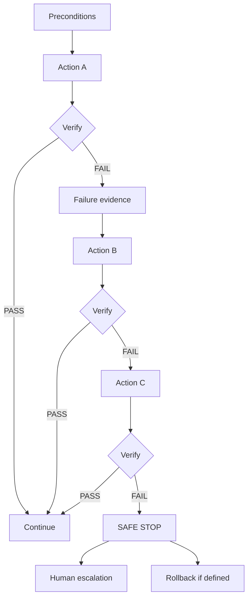

# ARGOS Phase 7 — Failure Matrix (A/B/C)

```
STATUS = PLANNING_ONLY
NO_IMPROVISATION_IN_AUTOMATION
REMOTE_REMEDIATION_VIA_AGENT = NOT_AUTHORIZED
```

Pattern for every row:

PLAN → PRECONDITIONS → A → VERIFY → (fail → evidence → B → VERIFY → C → VERIFY → SAFE STOP / ROLLBACK / HUMAN)

---

## Enrollment

| | |
|--|--|
| Signal | Enrollment fails / token invalid |
| A | Re-validate token hash, TTL, org/asset | Verify: structured error code |
| B | Issue new enrollment; revoke pending old | Verify: only one PENDING active per asset policy |
| C | Human checks asset ownership / operator error | SAFE STOP auto-enroll loops |
| Rollback | Expire tokens |

## Authentication

| | |
|--|--|
| Signal | 401/revoked credential |
| A | Reject; audit | Verify: no data written |
| B | If rotate window: accept previous version once | Verify: version match |
| C | Force revoke + require re-enrollment | HUMAN |
| Rollback | N/A |

## Heartbeat

| | |
|--|--|
| Signal | Missing heartbeats |
| A | Mark STALE | Verify: threshold crossed |
| B | Mark OFFLINE; asset coverage may → UNKNOWN | Verify: not HEALTHY |
| C | NOC escalate / check host OOB | SAFE STOP assuming protect |
| Rollback | N/A |

## Observation ingestion

| | |
|--|--|
| Signal | Schema/capability failure |
| A | Reject 400; audit | Verify: no row |
| B | Accept only allowlisted subset | Verify: capability bound |
| C | Disable capability on agent | HUMAN review malware |
| Rollback | Drop bad batch |

## Credential rotation

| | |
|--|--|
| Signal | Rotate interrupted |
| A | Keep prior cred valid in dual window | Verify: heartbeat with either |
| B | Re-issue rotate | Verify: new hash stored |
| C | Revoke all versions; re-enroll | HUMAN |
| Rollback | Restore prior version pointer |

## Credential revocation

| | |
|--|--|
| Signal | Wrong agent revoked |
| A | Confirm id/org in UI | Verify: preview |
| B | Undo = re-enroll (cannot un-revoke secretly) | Verify: new enrollment |
| C | Audit + incident note | HUMAN |
| Rollback | Re-enrollment only |

## Offline recovery

| | |
|--|--|
| Signal | Spool full / corrupt |
| A | Drop oldest; alert NOC | Verify: bound size |
| B | Quarantine corrupt file | Verify: agent still heartbeats |
| C | Reinstall agent | HUMAN |
| Rollback | N/A |

## Duplicate / replay

| | |
|--|--|
| Signal | Idempotency conflict / old seq |
| A | Return prior success; no double write | Verify: unique key |
| B | Reject replay older than watermark | Verify: audit |
| C | Revoke if malicious pattern | HUMAN |

## Cross-tenant rejection

| | |
|--|--|
| Signal | Cred org ≠ body org/asset |
| A | 403/404; audit critical | Verify: zero write |
| B | Auto-revoke credential | Verify: subsequent 401 |
| C | Security incident | HUMAN / SAFE STOP trust |

## NOC operator workflow

| | |
|--|--|
| Signal | org_admin calls NOC agents API |
| A | 403 NOC_FORBIDDEN | Verify |
| B | N/A | |
| C | N/A | |

---

## Health semantics failures (must never “fix” by lying)

| Problem | A | B | C |
|---------|---|---|---|
| Heartbeat OK but service down | Keep asset health from probes/obs | Open alert from failed obs | Incident; CHICO explains CRITICAL/WARNING |
| No heartbeat but PLATFORM probe OK | Agent STALE; asset may still have PLATFORM evidence | Do not mark HEALTHY from agent absence | Investigate agent host |
| Last health HEALTHY then agent offline | Decay to UNKNOWN if evidence stale | Alerts if monitors fail | HUMAN |

---

## A/B/C diagram


