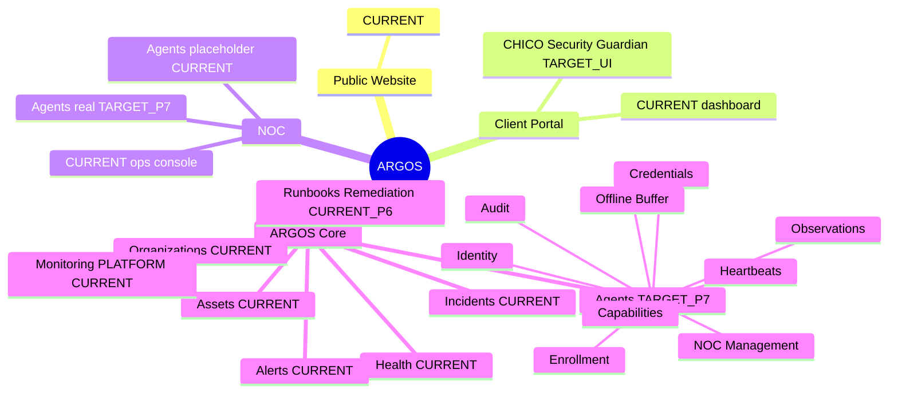
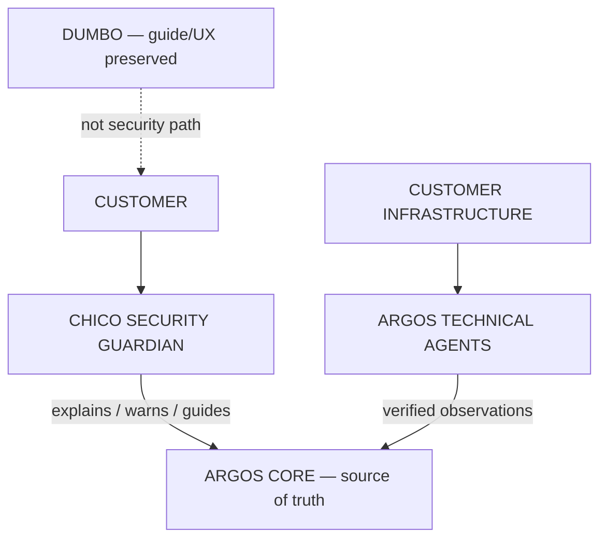
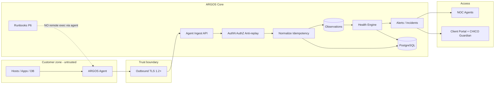
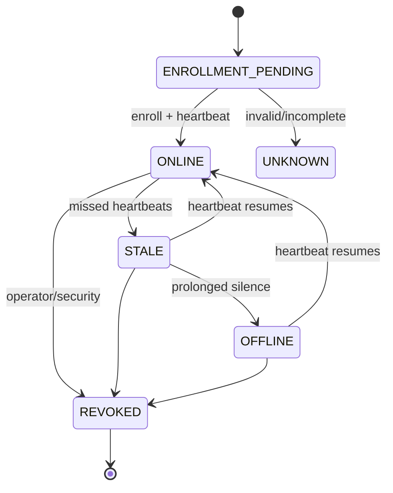
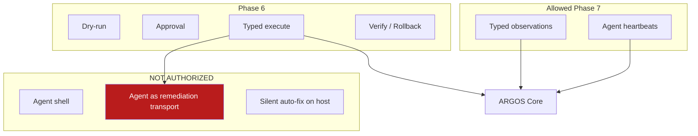
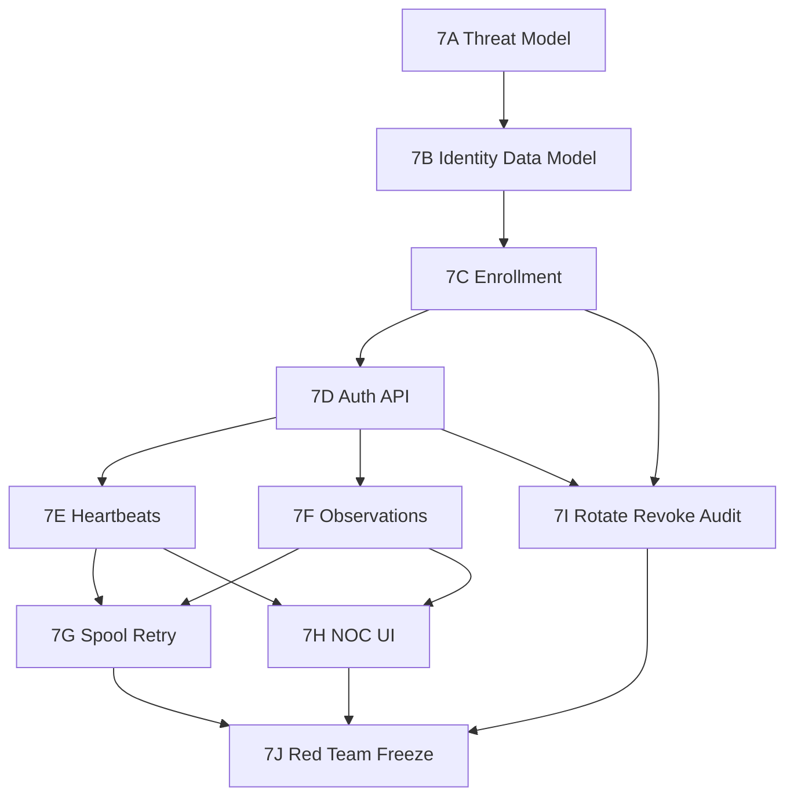
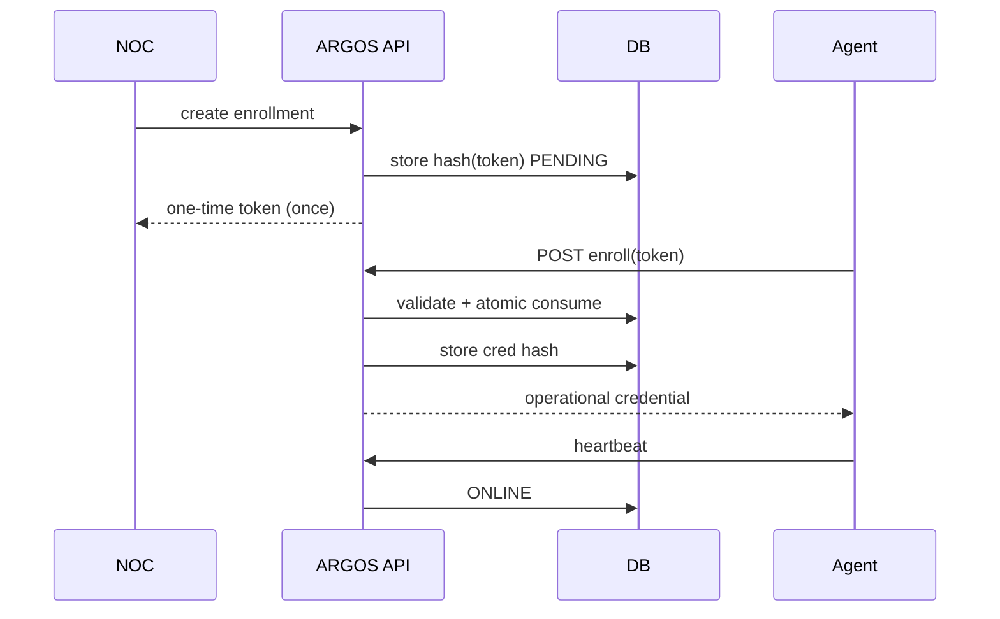
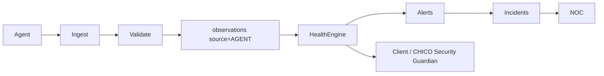

# ARGOS Phase 7 — Mental Map

```
STATUS = PLANNING_ONLY
IMPLEMENTATION_AUTHORIZED = NO
```

## CURRENT vs PHASE 7 TARGET



## CHICO — Security Guardian (canonical architecture)

```
                    CUSTOMER
                       │
                       ▼
                ┌─────────────┐
                │    CHICO    │
                │  SECURITY   │
                │  GUARDIAN   │
                └──────┬──────┘
                       │
            explains / warns / guides
                       │
                ┌──────▼──────┐
                │ ARGOS CORE  │
                │ SOURCE TRUTH│
                └──────┬──────┘
                       ▲
                       │
               VERIFIED OBSERVATIONS
                       ▲
                       │
              ┌────────┴────────┐
              │ ARGOS TECHNICAL │
              │      AGENTS     │
              └────────┬────────┘
                       ▲
                       │
              CUSTOMER INFRASTRUCTURE
```

Separately (not in the security path):

```
DUMBO = EXISTING ARGOS ROBOT PERSONA
      = GUIDE / UX ROLE PRESERVED
      = NOT SECURITY GUARDIAN
```



Cardinality: `1 org → 1 CHICO → many assets/monitors → 0..N technical agents`.

## Global after Phase 7 (TARGET)



## Agent state machine



Note: these are **agent** states, not asset HEALTHY/WARNING/CRITICAL/UNKNOWN.

## Phase 6 ↔ Agent boundary (remote execution BLOCKED)



## Implementation dependency graph



## Enrollment sequence



## Observation → Health path


