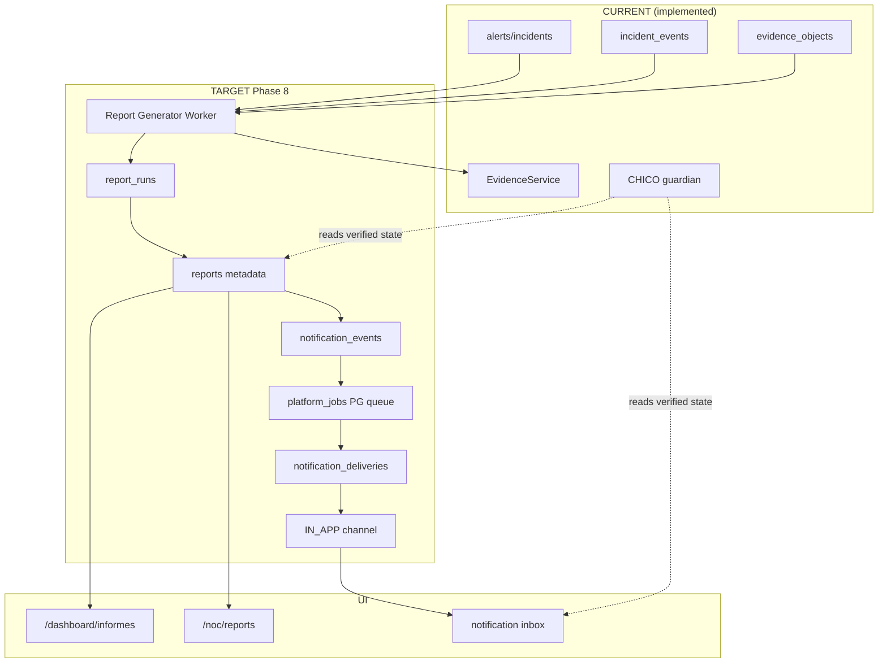

# ARGOS Phase 8 — Architecture

```
STATUS = PLANNING ONLY
IMPLEMENTATION_AUTHORIZED = NO
DATE = 2026-08-26
```

---

## 1. Capability classification (CURRENT)

| Capability | Status | Evidence |
|------------|--------|----------|
| evidence_objects + EvidenceService | IMPLEMENTED | `backend/lib/platform/evidenceService.js`, migration 006 |
| LocalPrivateObjectStore | IMPLEMENTED | default dev |
| S3CompatibleObjectStore | PARTIAL (POC) | MinIO local validated |
| INCIDENT_EVIDENCE_REFRESH | IMPLEMENTED | `backend/lib/remediation/actions/evidence.js` |
| Client evidence API | IMPLEMENTED | `backend/routes/clientEvidence.js` |
| NOC evidence API | IMPLEMENTED | `backend/routes/nocEvidence.js` |
| Report engine | NOT_IMPLEMENTED | — |
| Client `/dashboard/informes` | PLACEHOLDER | `frontend/app/dashboard/informes/page.tsx` |
| NOC `/noc/reports` | PLACEHOLDER | `frontend/app/noc/reports/page.tsx` |
| Notification system | NOT_IMPLEMENTED | — |
| Formspree (support) | PARTIAL | ad hoc, not product |
| Socket.IO chico_alert | PARTIAL | disabled, no client |
| Monitor scheduler | IMPLEMENTED | in-process |
| Remediation PG state machine | IMPLEMENTED | `backend/lib/remediation/engine.js` |
| PG job queue | PLANNED | ADR-004 |
| CHICO guardian | IMPLEMENTED | explain-only |
| activity_logs / security_logs | IMPLEMENTED | audit seed |
| incident_events | IMPLEMENTED | append-only |
| NOC operational queue UI | IMPLEMENTED | not same as job queue |

---

## 2. Target system overview

```
┌─────────────────────────────────────────────────────────────────┐
│                        ARGOS CORE (PG)                          │
│  organizations │ assets │ monitors │ alerts │ incidents         │
│  incident_events │ remediation_executions │ agents              │
│  evidence_objects │ activity_logs │ security_logs               │
│  reports │ report_runs │ notifications │ notification_deliveries│
│  platform_jobs (PG queue)                                       │
└───────────────────────────┬─────────────────────────────────────┘
                            │
         ┌──────────────────┼──────────────────┐
         ▼                  ▼                  ▼
   Report Worker      Notification Worker   HTTP API
         │                  │                  │
         ▼                  ▼                  ▼
   EvidenceService     IN_APP (MVP)      Client / NOC UI
         │              EMAIL (later)
         ▼              WEBHOOK (later)
   ObjectStore
   (local / S3)
```

---

## 3. Reporting pipeline (TARGET)

```
DATA SOURCES (PG authoritative)
   ↓
SNAPSHOT / QUERY (tenant-scoped, point-in-time)
   ↓
NORMALIZE (deterministic fields, UNKNOWN explicit)
   ↓
REPORT MODEL (JSON intermediate)
   ↓
RENDER (HTML template → PDF)
   ↓
EvidenceService.store (artifact bytes)
   ↓
report_runs row + evidence_object_id link
   ↓
reports metadata (READY)
   ↓
NOTIFICATION EVENT (REPORT_READY)
   ↓
CLIENT / NOC ACCESS (authenticated stream)
```

**No second storage path.** Report bytes = evidence_objects.

---

## 4. Notification pipeline (TARGET)

```
DOMAIN EVENT (alert/incident/report/remediation)
   ↓
NOTIFICATION POLICY (severity, anti-noise rules)
   ↓
RECIPIENT RESOLUTION (org membership + role + prefs)
   ↓
DEDUPE KEY (idempotency window)
   ↓
platform_jobs → notification_deliveries (QUEUED)
   ↓
WORKER → CHANNEL ADAPTER (IN_APP MVP)
   ↓
DELIVERED | FAILED | RETRY_WAIT | DEAD_LETTER
   ↓
AUDIT (activity_logs / security_logs)
```

---

## 5. Evidence intelligence boundary

Reports **reference** evidence; they do not embed raw artifact bytes inline.

```
Report Section
   → evidence_ref: { evidence_object_id, sha256, created_at, source }
   → optional summary text (derived, not authoritative)
```

Provenance chain: `report_run` → `evidence_object_id` → object_key → SHA-256 verified on read.

Historical intelligence = query across evidence_objects + incident_events + report metadata — not a separate warehouse in MVP.

---

## 6. CHICO boundary

| CHICO MAY | CHICO MUST NOT |
|-----------|----------------|
| Explain report is ready | Send email |
| Explain incident/alert state | Decide recipients |
| Explain evidence stale/UNKNOWN | Modify preferences |
| Explain verification completed | Invent report data |
| Link to portal pages | Become job scheduler |
| Surface selected in-app notifications (read) | Become delivery queue |

```
ARGOS CORE (reports/notifications)
        ↓ verified state
CHICO (customer explanation layer)
```

---

## 7. Job queue decision

**Hypothesis tested:** PostgreSQL job queue FIRST.

| Option | Verdict |
|--------|---------|
| PostgreSQL `platform_jobs` + worker | **MVP** — ADR-004, single transactional store, tenant keys in-row |
| In-process scheduler extension | **PARTIAL** — OK for monitors; insufficient for report/notify durability |
| Redis/BullMQ | **DEFER** — no evidence of saturation |
| Temporal | **DEFER** — ops burden, no multi-day cross-service need yet |

Worker process: separate Node entrypoint (`backend/worker.js` or similar) — **design only**.

---

## 8. Build vs integrate

| ARGOS owns | External may provide |
|------------|---------------------|
| Tenant/report semantics | PDF rendering library (e.g. puppeteer, pdfkit) |
| Report metadata model | HTML templating primitives |
| Notification policy | SMTP transport (later) |
| Recipient resolution | — |
| Audit | — |
| Client/NOC UX | — |
| Idempotency keys | — |
| Object storage transport | S3 SDK (existing) |

Do not outsource tenant/security semantics to third-party notification SaaS for MVP.

---

## 9. Client vs NOC visibility

| Surface | Client | NOC |
|---------|--------|-----|
| Reports list | Own org only | Cross-tenant |
| Report generate | Request (future policy) | Authorized generate/retry |
| Artifact download | Stream via API | Stream + audit cross-tenant |
| Delivery state | Own notifications | All deliveries + failures |
| Template version | Visible | Visible + debug |
| Failure reason | Sanitized | Full operator detail |
| Raw secrets | NEVER | NEVER (redacted) |

---

## 10. Dependency graph (Mermaid)



---

## 11. Format recommendation

| Format | Role | MVP |
|--------|------|-----|
| JSON | Report model intermediate + API metadata | YES |
| HTML | Canonical human render | YES |
| PDF | Audit artifact in EvidenceService | YES |
| CSV | Export slices | V1 |

PDF must be deterministic enough for audit: fixed template version, embedded `generated_at`, `organization_id`, `report_type`, `period`, `data_freshness`, `unknown_sections`, `evidence_references`, `template_version`.

---

## 12. Report type roadmap

| Report type | MVP | V1 | V1.5 | FUTURE |
|-------------|-----|----|----|--------|
| Incident Summary Report | **YES** | | | |
| Security Summary | | YES | | |
| Health Summary | | YES | | |
| TLS Report | | YES | | |
| Asset Status Report | | | YES | |
| Monitoring Coverage | | | YES | |
| Agent Status Report | | | YES | |
| Remediation Report | | | YES | |
| Monthly Executive | | | | YES |
| Technical Operations | | | | YES |
| Audit Evidence Report | | | | YES |

MVP = one type only (Incident Summary) to prove full pipeline.
