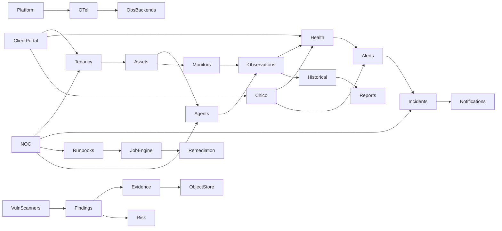

# ARGOS Platform Dependency Graph

## Critical path dependencies

1. Tenancy before any tenant data plane
2. Evidence metadata before object bytes
3. Telemetry hooks before Prometheus
4. Findings model before Trivy
5. Job idempotency before worker split
