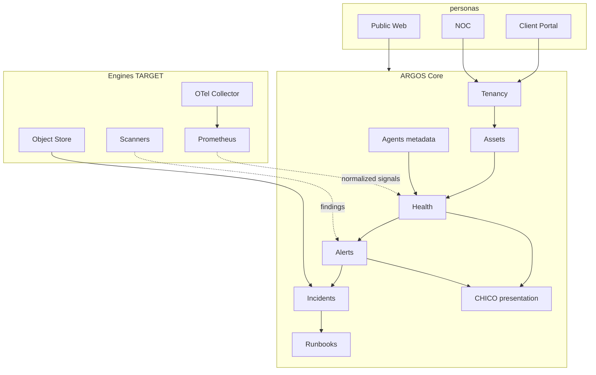

# ARGOS Platform Mental Map

```
DOCUMENT = ARGOS_PLATFORM_MENTAL_MAP
DATE = 2026-08-25
HTML = ARGOS_PLATFORM_MENTAL_MAP.html
```

## One-sentence map

**ARGOS today** = multi-tenant control plane (orgs → assets → monitors → health → alerts → incidents → runbooks → agents → CHICO) on Postgres + Express + Next.  
**ARGOS becoming** = same authority layer + observability fabric + object evidence + workers + connectors — engines subordinate to ARGOS truth.

## Domains

| Domain | CURRENT | TARGET next |
|--------|---------|-------------|
| Tenancy | Done | Harden quotas |
| Assets / TLS / DNS probes | Done | Broader inventory |
| Monitoring | HTTP/TLS/DNS | + host metrics via agents + OTel |
| Incidents / runbooks | Done (safe) | Durable jobs |
| Agents | Observation allowlist | More typed capabilities only |
| CHICO | Guardian UI | Security findings presentation |
| Reports / notifications | Not available | Phase 8 on object store |
| Object storage | None | MinIO/S3 + metadata in PG |
| Observability fabric | morgan | OTel → Prometheus/Loki/Tempo |
| Vuln / deps | None | Trivy/Semgrep → normalized findings |
| Privileged host security | None | DEFER (Wazuh/Falco) |
| K8s | None | REJECT for now |

## Dependency sketch (Mermaid)



## Implementation order (human view)

1. **Foundation** — schema completeness, port/storage governance, platform health honesty, interfaces  
2. **MVP platform** — object store + metadata, notification stub, telemetry hooks  
3. **V1** — OTel + Prometheus (private), findings model, worker split  
4. **V1.5** — logs/traces backends if needed; scoped scanners  
5. **Future** — Vault / Temporal / K8s / privileged agents **only with triggers**
