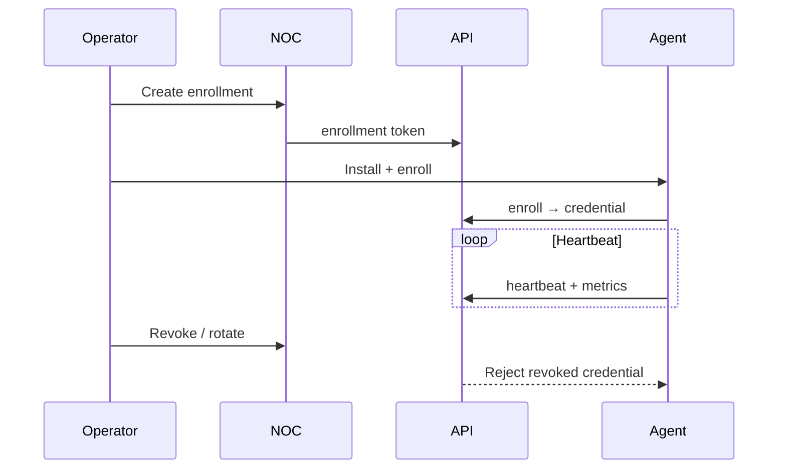

# ARGOS — Agent Deployment Plan

```
REMOTE_EXECUTION = NO
REMOTE_SHELL = NO
REMOTE_SQL = NO
REMOTE_REMEDIATION = NO
```

## CURRENT support (proven by code)

| Topic | Evidence |
|-------|----------|
| Reference agent | `agents/argos-agent-ref` (Node) |
| OS metadata | `os.platform()` / `os.release()` reported — **not** a multi-OS support matrix claim |
| Capabilities | Observation / heartbeat / metrics / spool |
| Auth | Bearer agent credential after enroll |
| Spool | Local JSON file retry |

**Do not claim** Windows/Linux/macOS production packaging beyond “Node reference agent runs where Node runs.”

## Staging lifecycle



## Steps

1. **Install** — place reference agent + env (`ARGOS_API_URL`, enroll secret)  
2. **Enroll** — one-time enrollment; store credential securely on host  
3. **Heartbeat** — respect `AGENT_STALE_AFTER_MS` / offline thresholds  
4. **Offline spool** — retry with backoff; no silent drop without log  
5. **Rotation** — revoke old + enroll new; overlap window documented  
6. **Revocation** — immediate NOC action; agent must fail closed  
7. **Upgrade** — replace binary/script; keep credential; smoke heartbeat  
8. **Uninstall** — revoke then remove  

## Forbidden

- Remote shell/SQL/exec  
- Treating agent online as org HEALTHY  
- CHICO inventing agent truth  

## Staging synthetic agents

Use lab hosts or containers with synthetic hostnames — never production customer endpoints without separate authorization.
