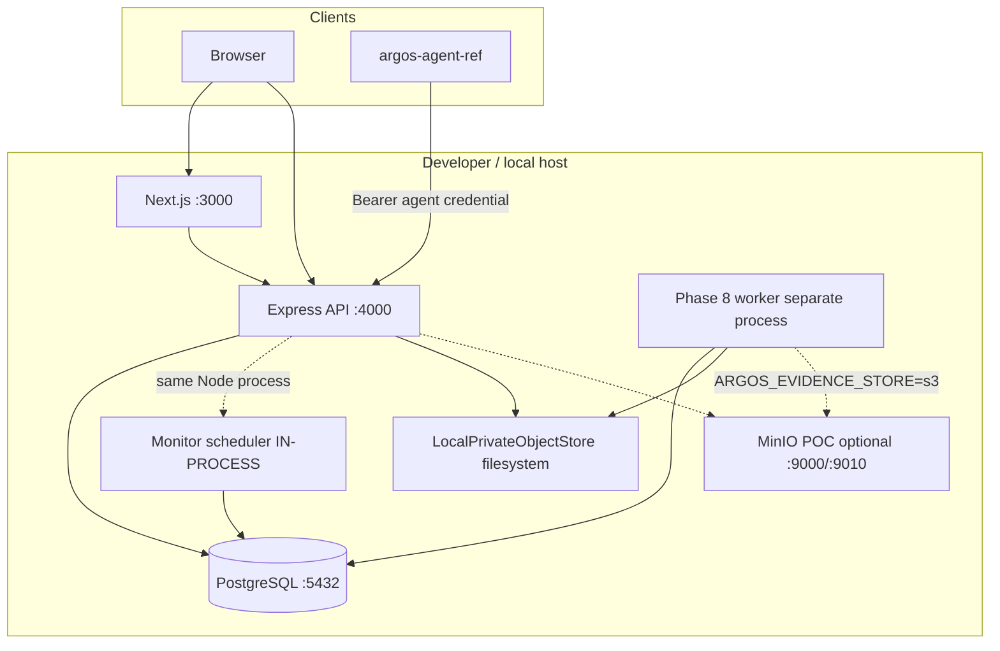

# ARGOS — Current Runtime Topology

```
STATUS = EVIDENCE FROM CODE @ 93b838f
DATE   = 2026-08-26
```

## 1. Process map (CURRENT local)



## 2. What exists vs what is missing

| Component | CURRENT | Notes |
|-----------|---------|-------|
| Frontend | YES | `npm run dev` / `next start` |
| API | YES | `npm --prefix backend run start\|dev` |
| PostgreSQL | YES | Required; API crashes without `DATABASE_URL` |
| Monitor scheduler | YES **inside API** | `ENABLE_MONITOR_SCHEDULER` default ON |
| Phase 8 worker | YES **manual** | `node backend/worker.js` — **not** in app Compose |
| Object store local | YES | Default `ARGOS_EVIDENCE_STORE=local` |
| MinIO | POC overlay | `docker/docker-compose.minio-poc.yml`; image `latest` = POC_ONLY |
| Agents | Reference agent | `agents/argos-agent-ref` — observation only |
| OTel / Prometheus / Grafana | TARGET only | Port registry; not wired |
| Socket.IO | Optional | Code defaults ON unless `ENABLE_SOCKET_IO=false` |

## 3. Startup sequence (local as practiced)

1. Start PostgreSQL  
2. Apply `database/migrate.sh` (or rely on API `ensure*` DDL — dual path)  
3. Start API (`backend`) → boots ensures + listens + starts scheduler if enabled  
4. Start Worker (required for READY reports)  
5. Start Frontend  

## 4. Dual schema path (CURRENT risk)

| Path | Mechanism |
|------|-----------|
| Formal | `database/migrate.sh` → `schema.sql` + numbered forward migrations |
| Runtime | `server.js` / `worker.js` call `ensure*` modules reading migration SQL |

Staging must pick a **single DDL authority** (prefer migrate job + least-privilege app role) and treat `ensure*` as safety net, not the only plan.

## 5. Health (CURRENT)

`GET /api/health`:

- 200 `{ status: "OK", db: "connected", timestamp }`
- 503 `{ status: "DEGRADED", db: "disconnected", timestamp }`

**Means:** API process + PostgreSQL ping.  
**Does not mean:** worker alive, scheduler ticking, object store reachable, customers healthy.

## 6. Compose CURRENT (`docker/docker-compose.yml`)

Services: `db`, `backend` (dev), `frontend` (dev).  
**Absent:** worker, MinIO, observability sidecars.

## 7. Trust boundaries (CURRENT)

```
PUBLIC website ── SiteShell legacy/corporate chrome
CLIENT /dashboard ── chromeOwner=none + ClientPortalShell
NOC /noc ── chromeOwner=none + NocShell (post visual mini-plan)
API ── cookies JWT (Client/NOC) | agent bearer | public limited AI/contact
PG / MinIO / evidence root ── private
```
