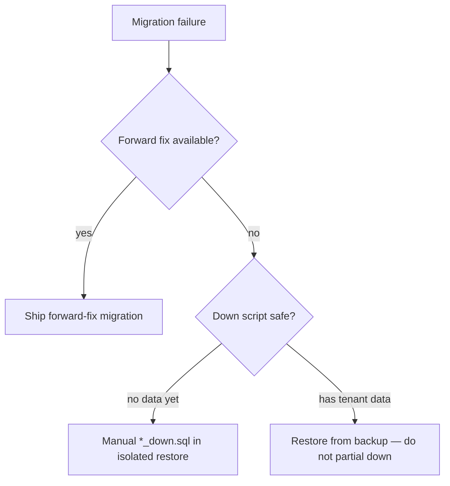

# ARGOS — Database Migration Plan

```
SOURCE = database/migrations + migrate.sh @ 93b838f
PRODUCTION_MIGRATION = NO
```

## 1. Inventory (forward)

| Migration | Purpose | Down file | Destructive down? | Locking risk | Data migration? | Ops risk |
|-----------|---------|-----------|-------------------|--------------|-----------------|----------|
| `001_organizations_foundation.sql` | Orgs / members foundation | **none** | N/A | Low (IF NOT EXISTS) | No | Low |
| `002_assets_tls.sql` | Assets + TLS | `002_assets_tls_down.sql` | DROP risk | Medium | No | Medium |
| `003_monitoring_alerts_incidents.sql` | Monitors/alerts/incidents | yes `_down` | DROP | Medium | No | Medium |
| `004_runbooks_remediation.sql` | Runbooks / remediation | yes | DROP | Medium | No | Medium |
| `005_agents_observation.sql` | Agents observation | yes | DROP | Medium | No | Medium |
| `006_evidence_objects.sql` | Evidence metadata | yes | DROP | Medium | No | Medium |
| `007_phase8_reports_notifications.sql` | Reports/jobs/notifications | yes | DROP | Medium | No | Medium |

Also: `database/schema.sql` (bootstrap), `refresh_sessions.sql`, `seed_admin.sql` (**manual**, not in migrate.sh).

## 2. `migrate.sh` behavior (proven)

1. Requires `DATABASE_URL`  
2. Applies `schema.sql` with `ON_ERROR_STOP`  
3. Applies `refresh_sessions.sql` if present  
4. Forward-only: numbered `*.sql`, **skips `*_down.sql`**  
5. Prints that rollback is manual  

**Proof:** `database/migrate.sh` lines 35–48 explicitly `continue` on `*_down.sql`.

## 3. Staging procedure (TARGET)

```
1. Snapshot/backup staging DB
2. Record schema version / migration list applied
3. Run migrate.sh with DDL role (not app DML role)
4. Verify tables/constraints (reports, platform_jobs, evidence_objects, …)
5. Smoke: /api/health, login, list reports, worker claim
6. Keep app role without CREATE/DROP
```

## 4. Rollback decision tree



Prefer **forward-fix** once staging holds synthetic-but-valuable state.

## 5. Compatibility window

| App | Schema |
|-----|--------|
| Old API + new schema | May break if columns required |
| New API + old schema | `ensure*` may partially heal; **do not rely** |
| Worker + schema | Must match Phase 8 tables |

Deploy rule: migrate → verify → roll app/worker.
