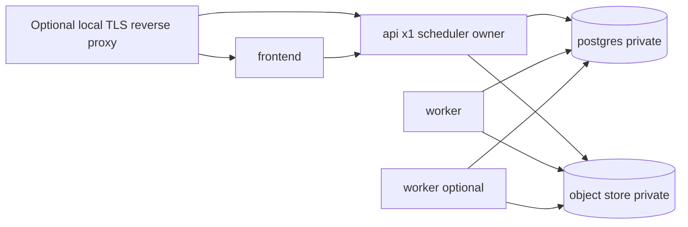

# ARGOS — Staging Architecture

```
STATUS = TARGET (not deployed)
KUBERNETES_ADOPT_NOW = NO
```

## 1. Recommended topology

**Single private host (or local staging host) + Docker Compose** with pinned images.



### Why Compose, not Kubernetes

- Current scale S0–S1
- Scheduler cannot safely multi-own without redesign
- Team operational load
- Boring > clever

### Alternatives considered

| Option | Verdict |
|--------|---------|
| systemd on one VM | Acceptable if Compose unavailable; same process set |
| Managed containers (Fly/Railway/…) | Deferred — no provider authorized |
| Kubernetes | **NO** now |

## 2. Process supervision policy

| Policy | Value |
|--------|-------|
| `restart` | `unless-stopped` / `on-failure` |
| API replicas | **1** with scheduler ON; or N with scheduler ON only on designated owner |
| Worker replicas | ≥1; safe concurrent claim |
| Graceful shutdown | SIGTERM → 30s stop_grace |
| Job ownership | `platform_jobs.claimed_by` + stale reclaim 15m |
| Scheduler duplication | **SCALE_BLOCKER** if >1 API with scheduler ON |

## 3. Staging data policy

- Synthetic orgs / assets / incidents / agents / evidence / reports only  
- **No** production DB copy  
- Future sanitized snapshot = separate human gate  

## 4. Object storage staging recommendation

| Option | When |
|--------|------|
| **Pinned MinIO** (private bind, versioned image digest) | Default for isolated staging |
| Managed S3-compatible | When cloud account authorized later |
| LocalPrivateObjectStore | Acceptable for single-node staging only; backup harder |

`minio/minio:latest` from POC is **not** staging-ready — pin digest.

## 5. Configuration posture

- `NODE_ENV=production` for app containers in staging (behavior parity) **or** explicit staging mode documented — prefer production Node env with staging secrets  
- `ARGOS_ALLOW_RATE_LIMIT_RESET` unset  
- `ARGOS_REPORT_PDF_STUB` unset  
- `ALLOW_NOC_SELF_APPROVAL` unset/false  
- `ENABLE_SOCKET_IO=false` until needed  
- Distinct `JWT_*`, DB, S3 credentials from any local developer machine  

## 6. Ingress

Default bind: private / localhost.  
Controlled ingress only for frontend (+ API if split hostnames).  
PostgreSQL, MinIO API, MinIO console, worker: **no public exposure**.
