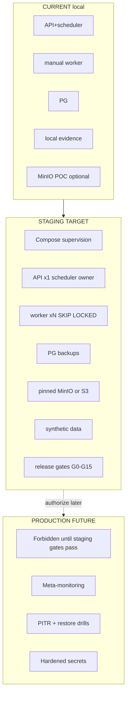
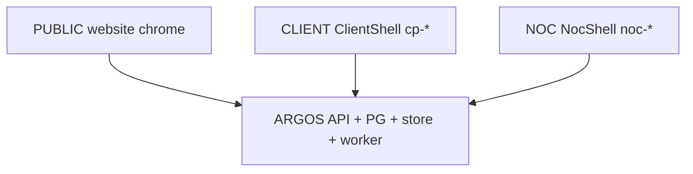

# ARGOS — Staging Mental Map

## Three planes



## Experience isolation



## Job / report mental path

```
Client POST /api/client/reports
  → report_runs QUEUED
  → platform_jobs QUEUED
  → worker claim SKIP LOCKED
  → model → HTML → Chromium PDF
  → EvidenceService
  → READY + REPORT_READY notification
```

## Scheduler mental path (CURRENT risk)

```
API process tick 15s
  → SELECT due monitors (no row lock)
  → executeCheck
  → update next_check_at AFTER run
```

If two APIs: **duplicate checks** possible → mark SCALE_BLOCKER.
